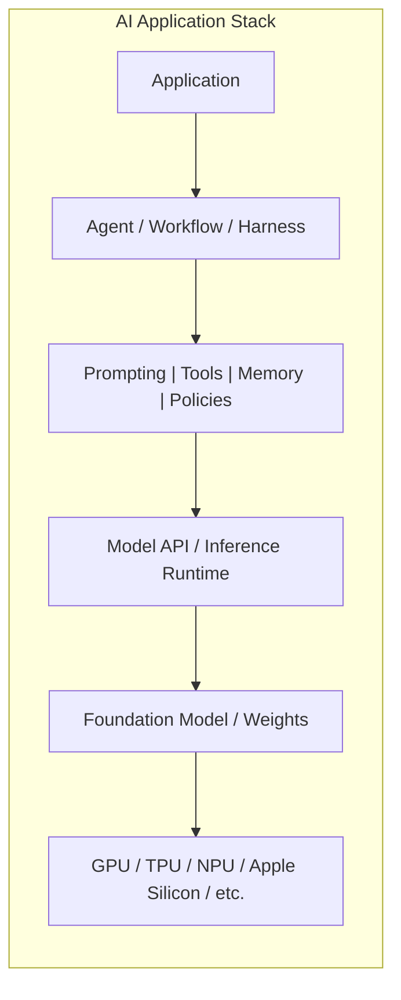
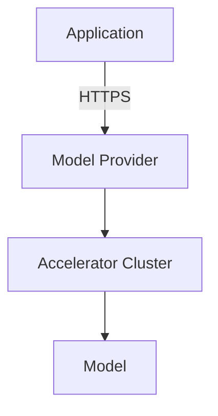
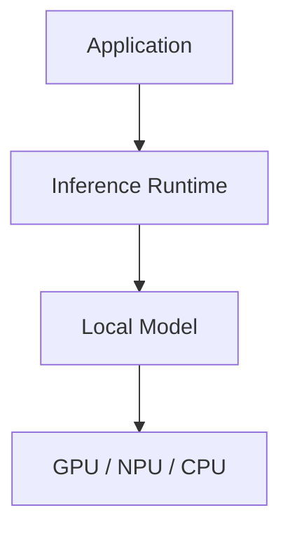
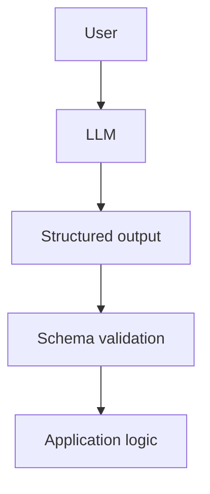
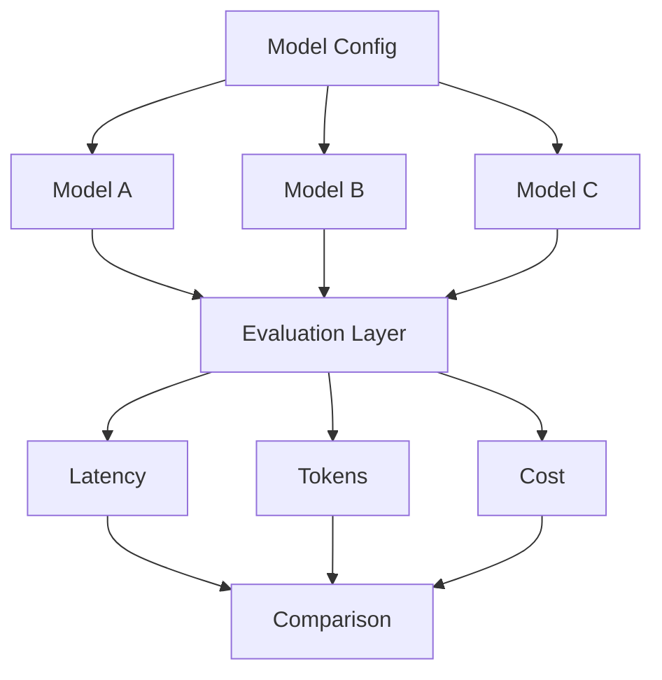
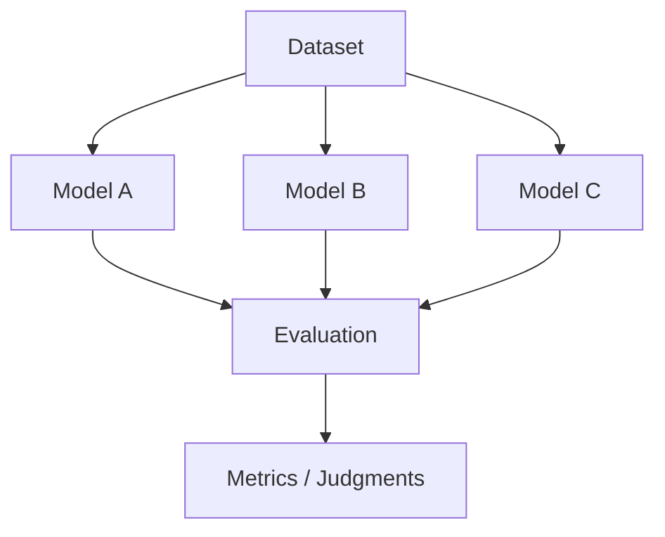
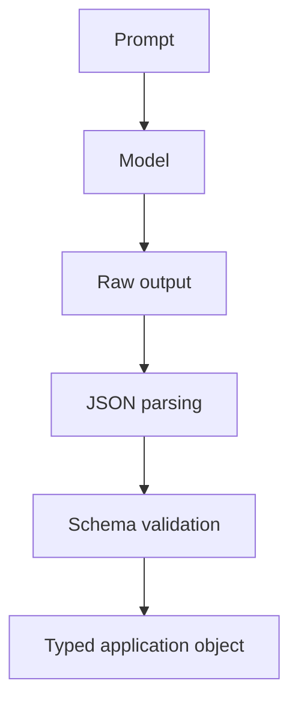
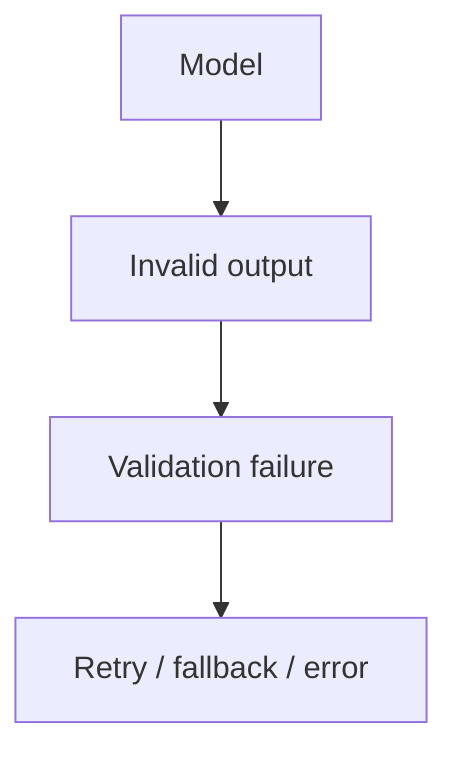
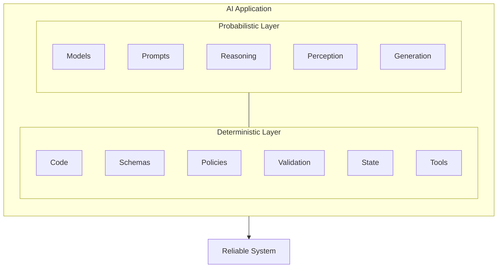

# Chapter 1: Building AI Applications

## LLMs Are Probabilistic Components

Traditional software engineering is built around deterministic abstractions.

A function takes an input and, barring bugs or undefined behavior, produces a predictable output:

$$
y = f(x)
$$

If the function is called twice with the same input and the same state, the engineer generally expects the same result.

Large language models are fundamentally different. An LLM computes a probability distribution over possible continuations:

$$
P(y \mid x, \theta)
$$

where $x$ is the input context, $y$ is a possible output sequence, and $\theta$ represents the model parameters.

The system does not inherently know that your application requires valid JSON, correct SQL, a particular API call, or a response that satisfies a business invariant. It generates a statistically likely continuation.

That distinction is the foundation of modern AI application engineering.

The central engineering problem is therefore not simply:

> How do I call an LLM?

It is:

> How do I construct a reliable software system around a probabilistic component?

That shift in perspective changes almost everything: architecture, testing, observability, error handling, model selection, deployment, and even how applications are designed.

This chapter establishes the conceptual foundation for building such systems.

---

## 1. The New AI Application Stack

The conventional software stack might look roughly like:

$$
\text{Application}
\rightarrow
\text{Libraries}
\rightarrow
\text{Operating System}
\rightarrow
\text{Hardware}
$$

AI applications introduce a new computational layer:

$$
\text{Application}
\rightarrow
\text{AI Runtime / Harness}
\rightarrow
\text{Model}
\rightarrow
\text{Accelerator}
$$

But this is still too simplistic.

A production AI application typically contains several interacting layers:



The model is only one component.

A useful mental model is to think of an LLM as analogous to a processor that performs a highly capable but nondeterministic computation. The surrounding software must provide the contracts that the model itself does not guarantee.

Those contracts include:

* input representation,
* output representation,
* latency expectations,
* resource limits,
* error handling,
* authorization,
* tool access,
* validation,
* observability,
* evaluation,
* fallback behavior.

The quality of an AI application is therefore determined by the entire system, not merely by the benchmark score of its underlying model.

---

## 2. Foundation Models

A foundation model is a pretrained model capable of performing many downstream tasks through conditioning rather than being trained from scratch for each application.

For language models, the basic interface is conceptually:

$$
\text{tokens}_{1:n}
\rightarrow
P(\text{next token}\mid\text{tokens}_{1:n})
$$

Generation proceeds autoregressively. Given a sequence of tokens, the model predicts a distribution for the next token:

$$
P(x_{n+1}\mid x_1,\dots,x_n)
$$

The selected token is appended to the context, and the process repeats.

Thus:

$$
x_1,\dots,x_n
\rightarrow x_{n+1}
\rightarrow x_{n+2}
\rightarrow \cdots
$$

This deceptively simple interface gives rise to remarkably general behavior.

The same model can potentially perform:

* summarization,
* classification,
* code generation,
* reasoning,
* extraction,
* translation,
* question answering,
* planning,
* tool selection,
* multimodal interpretation.

But general capability does not imply reliability.

A foundation model should therefore be treated as a **general-purpose probabilistic computation engine**, not as a trusted business-logic component.

---

## 3. APIs Versus Local Models

The first architectural decision is often whether inference happens remotely or locally.

### Hosted inference

With an API-based architecture:



The provider manages:

* hardware,
* model deployment,
* scaling,
* scheduling,
* inference optimization,
* model updates,
* availability.

The application pays primarily in terms of API cost and network latency.

This is operationally attractive, particularly during prototyping.

### Local inference

With local inference:



The application gains greater control over:

* latency,
* privacy,
* availability,
* model versions,
* quantization,
* batching,
* memory placement,
* inference configuration.

But the engineering burden increases substantially.

You now own problems such as:

* model packaging,
* memory management,
* accelerator compatibility,
* runtime optimization,
* model loading,
* concurrency,
* thermal constraints,
* update mechanisms.

Neither architecture is universally superior.

The right question is:

> Which deployment architecture provides the required quality, latency, cost, privacy, and operational characteristics for this workload?

---

## 4. Tokens: The Fundamental Unit of LLM Computation

LLMs do not fundamentally process words.

They process **tokens**.

A tokenizer maps text into a sequence:

$$
T: \text{text} \rightarrow (t_1,t_2,\dots,t_n)
$$

For example, a phrase such as:

```text
The model is generating tokens.
```

might be represented by several tokens rather than five semantic words.

The exact tokenization depends on the model and tokenizer.

This matters because tokens affect nearly every operational property of an LLM system.

### Context windows

The model operates over a finite context:

$$
C = [x_1,x_2,\dots,x_n]
$$

where $n$ cannot exceed the model's context limit.

The effective context may contain:

```text
System instructions
+
Conversation history
+
Retrieved documents
+
Tool definitions
+
Tool results
+
Current user request
```

Consequently, context is a scarce computational resource.

A larger context window is not equivalent to unlimited memory.

More context can increase:

* latency,
* memory consumption,
* inference cost,
* attention computation,
* irrelevant information,
* opportunities for conflicting instructions.

One of the central skills in AI engineering is therefore **context management**.

---

## 5. Prompting as Programming

Prompting is frequently described as "telling the model what to do."

For an engineer, a better abstraction is:

> Prompting is programming a probabilistic interpreter through natural-language and structured context.

A prompt establishes the computational environment in which the model generates its output.

A simplified representation is:

$$
y \sim P_\theta(y \mid x_{\text{system}},x_{\text{user}},x_{\text{tools}},x_{\text{history}})
$$

Changing any component changes the output distribution.

This explains why seemingly minor changes can produce large behavioral differences.

A production prompt should therefore be treated as an engineering artifact.

It should have:

* explicit requirements,
* defined inputs,
* defined outputs,
* constraints,
* examples where useful,
* failure behavior,
* versioning.

The prompt is not merely text.

It is part of the program.

---

## 6. Structured Outputs

One of the most important transitions in AI application engineering is moving from:

```text
LLM → prose
```

to:

```text
LLM → typed data
```

Suppose an application asks a model to classify a support request.

A natural-language output might be:

```text
This appears to be a billing issue with high urgency.
```

An application needs something more precise:

```json
{
  "category": "billing",
  "priority": "high",
  "confidence": 0.93
}
```

Now the model can participate in a conventional software pipeline:



The critical distinction is between **generation** and **validation**.

Never assume:

$$
\text{valid-looking output} \implies \text{valid output}
$$

Instead:

$$
\text{LLM output}
\rightarrow
\text{parse}
\rightarrow
\text{validate}
\rightarrow
\text{accept/reject}
$$

For example, a JSON Schema might enforce:

```text
category in {billing, technical, account}
priority in {low, medium, high}
confidence in [0,1]
```

This creates an explicit interface between probabilistic and deterministic software.

That interface is one of the most important abstractions in AI engineering.

---

## 7. Tool Calling

A model cannot directly perform most actions in the external world.

It cannot inherently:

* query your database,
* send an email,
* modify a file,
* call an internal service,
* execute a deployment,
* retrieve current inventory.

Instead, the application exposes tools.

Conceptually:

```text
User request
     ↓
    LLM
     ↓
Tool selection
     ↓
Application runtime
     ↓
Tool execution
     ↓
Tool result
     ↓
    LLM
     ↓
Final response
```

The model proposes an action; deterministic software executes it.

For example:

```json
{
  "tool": "get_weather",
  "arguments": {
    "location": "Portland, Oregon"
  }
}
```

The runtime then executes:

```python
result = get_weather("Portland, Oregon")
```

and returns the result to the model.

This establishes a powerful architectural principle:

> The model should decide **what should happen**; deterministic software should decide **whether it is allowed to happen and how it actually happens**.

This separation is essential for security and reliability.

The model should not be trusted with arbitrary authority.

A tool interface should define:

* allowed operations,
* argument schemas,
* authentication,
* authorization,
* resource limits,
* side effects,
* error semantics.

---

## 8. Multimodal Models

Modern foundation models increasingly operate over multiple modalities.

Instead of:

$$
\text{text} \rightarrow \text{text}
$$

we can have:

$$
(\text{text},\text{image},\text{audio},\text{video})
\rightarrow
(\text{text},\text{structured data},\text{actions})
$$

This fundamentally changes application architecture.

Consider an engineering application that receives a screenshot of a failed test:

```text
Screenshot
    ↓
Vision-language model
    ↓
Interpretation
    ↓
Structured diagnosis
    ↓
Tool call
    ↓
Test infrastructure
```

The model becomes an interface between heterogeneous data and software systems.

But multimodality does not eliminate uncertainty.

Image interpretation can be wrong.

Audio transcription can be wrong.

Video understanding can be incomplete.

A multimodal model remains a probabilistic component and therefore requires the same engineering discipline:

$$
\text{Inference}
\rightarrow
\text{Validation}
\rightarrow
\text{Decision}
$$

---

## 9. Inference Parameters

Model behavior depends not only on the model weights but also on inference configuration.

A simplified generation process samples from:

$$
P_\theta(x_{t+1}\mid x_{\leq t})
$$

Temperature modifies the distribution before sampling.

If logits are $z_i$, temperature $T$ produces:

$$
P_i =
\frac{\exp(z_i/T)}
{\sum_j \exp(z_j/T)}
$$

As $T$ decreases, the distribution becomes more concentrated.

As $T$ increases, it becomes flatter.

Other inference parameters can influence:

* sampling behavior,
* maximum output length,
* repetition,
* stopping conditions,
* deterministic versus stochastic generation.

The important engineering lesson is that inference configuration is part of the application's behavior.

If you benchmark a system with one configuration and deploy another, you are no longer deploying the system you benchmarked.

Configuration therefore belongs in:

* source control,
* experiment metadata,
* evaluation datasets,
* observability,
* reproducibility infrastructure.

---

## 10. Model Selection

The strongest available model is not automatically the correct model.

Suppose you have three models:

| Model |   Quality | Latency |   Cost |
| ----- | --------: | ------: | -----: |
| A     | Excellent |    High |   High |
| B     | Very good |  Medium | Medium |
| C     |      Good |     Low |    Low |

If the task is trivial classification, using Model A may be irrational.

If the task involves difficult reasoning over complex code, Model C may be inadequate.

Model selection is therefore an optimization problem.

One useful abstraction is:

$$
\text{Utility} = f(Q,L,C,R)
$$

where:

* $Q$ = quality,
* $L$ = latency,
* $C$ = cost,
* $R$ = reliability.

The weights depend on the application.

For an interactive coding assistant, latency may dominate.

For an offline data-processing pipeline, cost may dominate.

For a safety-critical analysis system, quality and reliability may dominate.

The correct model is therefore the **best model for the workload**, not necessarily the model with the highest benchmark score.

---

## 11. Latency, Cost, and Quality

AI systems expose an unusually explicit three-way tradeoff:

$$
\text{Quality}
\leftrightarrow
\text{Latency}
\leftrightarrow
\text{Cost}
$$

Improving one dimension often affects the others.

For example:

* larger models generally require more computation;
* longer contexts increase inference work;
* longer outputs increase generation time;
* stronger models often cost more;
* local inference may reduce network latency but increase infrastructure cost.

Latency itself should be decomposed.

For an API request:

$$
L_{\text{total}} = L_{\text{network}}
+
L_{\text{queue}}
+
L_{\text{prefill}}
+
L_{\text{decode}}
+
L_{\text{postprocess}}
$$

This decomposition is important.

A model may have excellent token-generation throughput while still producing poor user-perceived latency because the system spends too long waiting for:

* network round trips,
* request queues,
* context processing,
* tool calls.

For streaming applications, another useful metric is **time to first token**:

$$
TTFT = t_{\text{first token}} - t_{\text{request}}
$$

while generation throughput can be measured as:

$$
TPS = \frac{\text{generated tokens}}
{\text{generation time}}
$$

A production AI engineer should understand both.

---

## 12. The Model Playground

The first practical exercise is deliberately small.

Build a Python application that treats different LLMs as interchangeable computational components.

The application should support:



The goal is not to build a polished UI.

The goal is to establish an engineering interface around inference.

---

### 12.1 Multiple Models

Define a common abstraction:

```python
class Model:
    def generate(self, messages, **kwargs):
        ...
```

The application should be able to substitute models without changing the rest of the system.

This forces an important architectural question:

> What is the minimal interface an application actually needs from a model?

At minimum, you may need:

```text
model identifier
input messages
generation parameters
output text
usage statistics
latency
errors
```

Once this abstraction exists, experimentation becomes dramatically easier.

---

### 12.2 Streaming

Instead of waiting for:

```text
request → complete response
```

stream:

```text
request → token → token → token → ...
```

Streaming improves perceived responsiveness.

But it introduces additional engineering complexity.

The system must distinguish:

$$
TTFT
$$

from:

$$
T_{\text{complete}}
$$

and:

$$
TPS
$$

It must also handle partial responses and failures occurring midway through generation.

Streaming therefore provides a first introduction to an important AI-systems principle:

> User-perceived performance is not the same thing as model throughput.

---

## 13. Measuring Tokens

Every request should record token usage.

At minimum:

```text
input_tokens
output_tokens
total_tokens
```

These numbers enable cost and performance analysis.

For a simple pricing model:

$$
C = N_{\text{input}}P_{\text{input}}
+
N_{\text{output}}P_{\text{output}}
$$

where $P$ represents price per token.

This quickly becomes important.

Suppose a request uses $10,000$ input tokens and produces $1,000$ output tokens.

A system processing one request is trivial.

A system processing $1,000,000$ such requests is not.

AI engineering therefore requires thinking about **unit economics at the inference level**.

A useful production metric is:

$$
\text{Cost per successful task}
$$

rather than merely:

$$
\text{Cost per API call}
$$

because retries, failures, tool calls, and multi-step reasoning all contribute to the actual cost of accomplishing useful work.

---

## 14. Comparing Outputs

A model playground should make side-by-side comparison easy.

Given:

$$
x \rightarrow
\{M_1(x),M_2(x),M_3(x)\}
$$

you should be able to inspect:

* semantic quality,
* factual accuracy,
* instruction adherence,
* formatting,
* latency,
* token consumption,
* cost.

This leads naturally toward evaluation.

Human inspection is useful for early experimentation, but it does not scale.

Eventually you need:



The playground is therefore the beginning of an evaluation harness.

---

## 15. Enforcing Structured JSON

The final requirement of the playground is to make the model produce structured output.

For example:

```json
{
  "answer": "string",
  "confidence": 0.0,
  "reasoning_required": true
}
```

The engineering pipeline should be:



If parsing fails:



This is the beginning of a **reliability boundary**.

The model operates on one side.

Deterministic software operates on the other.

The interface between them should be explicit.

---

## 16. What You Should Learn From the Project

The Model Playground is intentionally modest.

You are not trying to build an AI assistant.

You are learning to construct an **inference substrate**.

By the end of the exercise, you should be able to answer:

### Model abstraction

* How do I swap one model for another?
* Which model capabilities are actually required?
* What differs between providers?

### Performance

* What is time to first token?
* What is generation throughput?
* How does context length affect latency?
* Where is latency actually being spent?

### Economics

* How many tokens does a task consume?
* What does one successful task cost?
* Which model provides the best quality/cost ratio?

### Reliability

* Can the output be parsed?
* Does it satisfy a schema?
* What happens when the model fails?
* What happens when the provider times out?

### Architecture

* Which responsibilities belong to the model?
* Which belong to deterministic application code?
* Where should validation occur?
* Where should observability occur?

These are much more important questions than simply learning an SDK.

---

## 17. The Core Mental Model

The most important idea from this first week can be summarized as:

$$
\boxed{
\text{AI Application} = \text{Probabilistic Components} + \text{Deterministic Systems}
}
$$

The model supplies capabilities that are difficult to implement conventionally:

* language understanding,
* generation,
* perception,
* semantic matching,
* reasoning,
* planning.

Traditional software supplies what models are poor at guaranteeing:

* invariants,
* permissions,
* transactions,
* exact computation,
* state management,
* validation,
* resource management,
* observability.

A robust AI application deliberately separates these responsibilities.



The mistake is to ask the model to provide guarantees it was never designed to provide.

The engineering discipline is to surround probabilistic computation with deterministic boundaries.

---

## 18. Looking Ahead

Once an LLM is understood as a probabilistic component, the rest of AI application engineering becomes easier to reason about.

The next questions naturally follow:

* How do we retrieve the right information?
* How do we manage context?
* How do we evaluate outputs?
* How do we recover from failures?
* How do we give models access to tools safely?
* How do we build multi-step agents?
* How do we make inference fast enough?
* How do we reduce cost?
* How do we know whether a model actually improved?
* How do we deploy and observe these systems in production?

These are not primarily prompting questions.

They are systems-engineering questions.

And that is the fundamental transition this first week is designed to establish:

> **The future of AI application development is not about writing better prompts around a magical model. It is about engineering reliable systems around increasingly capable probabilistic computation.**

