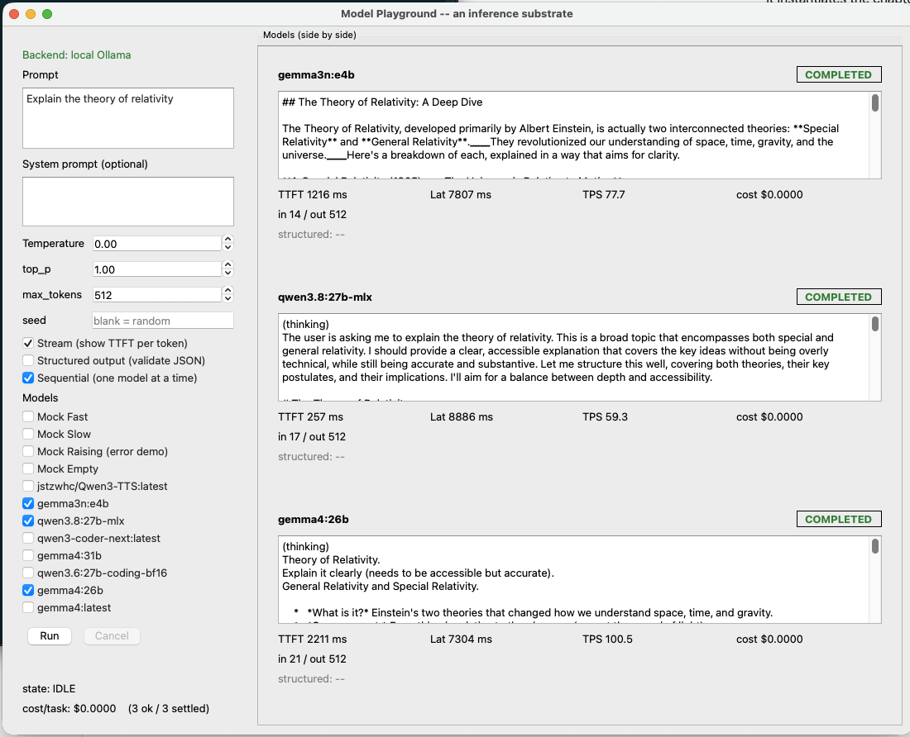

# model-playground

A PyQt5 + uv desktop **inference substrate**: run one prompt through several LLMs
**side by side** and inspect, per model, not just the text but the properties that
decide application quality — latency (TTFT / total), throughput (TPS), token usage,
cost, and a **validated** structured output. The grid shows **exactly the selected**
models side by side; each model runs in its own worker, and a reasoning model's
chain-of-thought (e.g. `gemma4`, which streams `thinking` while `content` stays empty)
is surfaced in its own panel block and counted toward first-token timing.

The models are **local**, served by the [Ollama](https://ollama.com) runtime
(`http://localhost:11434`, §0 deployment decision — chapter §3 "APIs vs. Local
Models"). No cloud API and no key are required: when Ollama is not running, the app
degrades to a deterministic `MockModel`.

It instantiates the chapter's thesis *`AI Application = Probabilistic Components +
Deterministic Systems`*: the model supplies the probabilistic computation; everything
else (metrics, JSON-schema validation, retry/fallback, threading, pricing, discovery)
is the **deterministic boundary** the model does not guarantee.

> The authoritative description of behavior, contracts, invariants, edge cases, and
> acceptance criteria for this project is **`SPEC.md`**. Implementation should be
> derived from it; see `SPEC.md §11 Traceability` for the id mapping.

## Screenshot

Three real local models run side by side — a plain chat model (`gemma3n:e4b`) and two
reasoning models (`qwen3.8:27b-mlx`, `gemma4:26b`) whose `(thinking)` chain-of-thought is
shown above the answer — each with a `COMPLETED` status and its TTFT / Lat / TPS / cost
metrics and `in N / out 512` token usage.



## Requirements

- Python **3.12** (managed by `uv`)
- Display: a desktop session (GUI). Headless CI uses the Qt `offscreen` platform.
- **No Ollama needed** for the default `MockModel` runs and the full test suite; Ollama
  is an *optional* host prerequisite for the real path.

## Development setup

```bash
# optional: make a real local model available to the GUI
# ollama pull llama3.2    # plain chat model
# ollama pull gemma3      # reasoning model (separate thinking channel)

uv sync                 # creates .venv (Python 3.12) and installs deps
uv run pytest           # run the SPEC §9 suite (fully offline; no Ollama needed)
uv run model-playground # launch the GUI (Ollama if reachable, else mock models)
```

## Layout (derived from `SPEC.md` §3–§5)

```
src/model_playground/
  types.py        # C-01 core types: Message, GenerationParams, Usage, StreamChunk (+ thinking), ModelResponse
  model.py        # C-02 Model interface + OllamaModel + MockModel (+ slow/raising variants)
  ollama.py       # C-03b OllamaClient: thin httpx client over /api/chat, /api/tags (+ thinking channel)
  registry.py     # C-03 ModelRegistry + ModelSpec (pricing lives here only); local discovery
  metrics.py      # C-04 RunMetrics + compute_metrics (TTFT / TPS / cost / per-task)
  structured.py   # C-05 parse_json + validate + retry/fallback (the reliability boundary)
  worker.py       # C-06 RunWorker(QThread), one per model; token_thinking signal, T-04 first-token
  ui.py           # §5 MainWindow + side-by-side panels for selected models + Ollama-unreachable banner
  app.py          # main()
tests/            # SPEC §9 (pure + offscreen GUI + network-stubbed Ollama client), conftest.py
```
