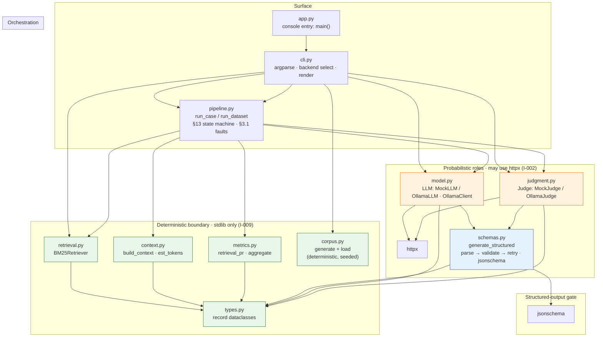
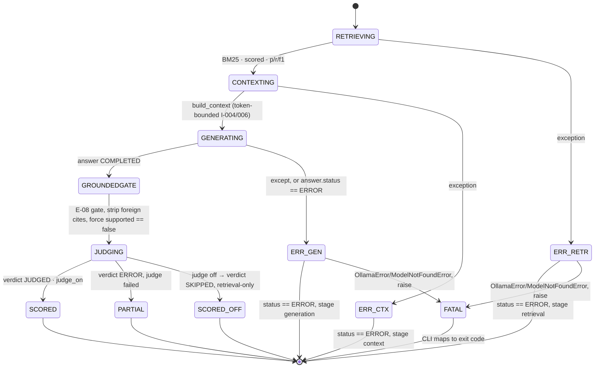
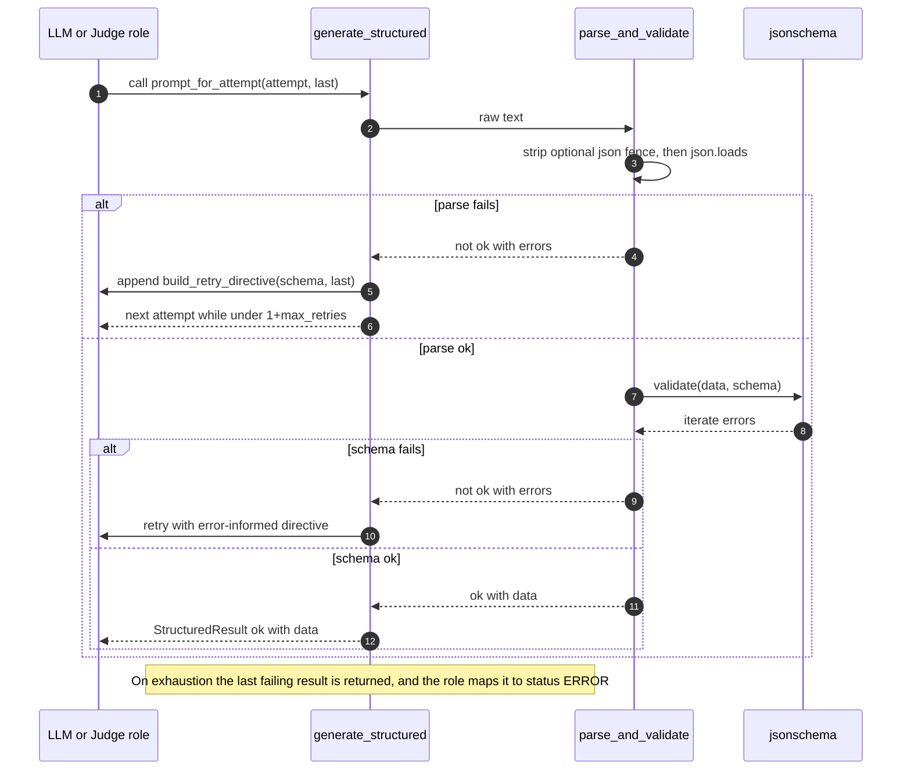
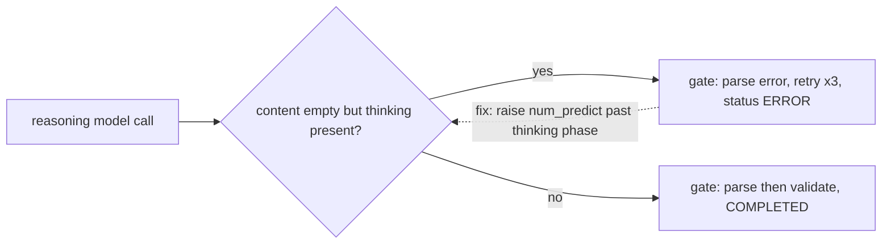
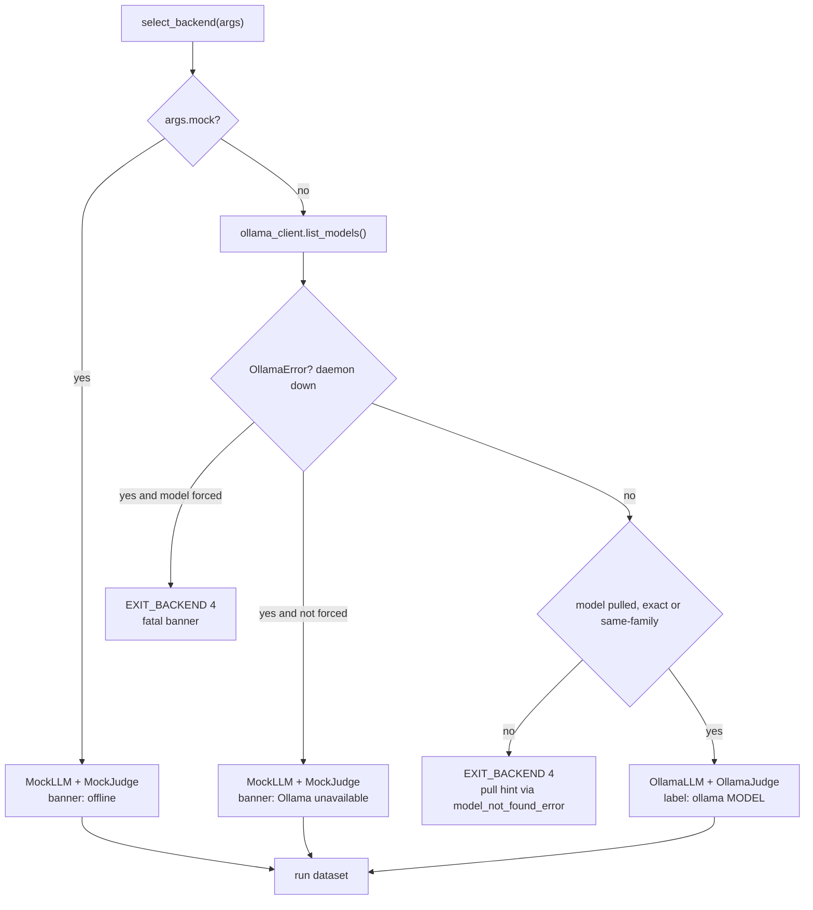
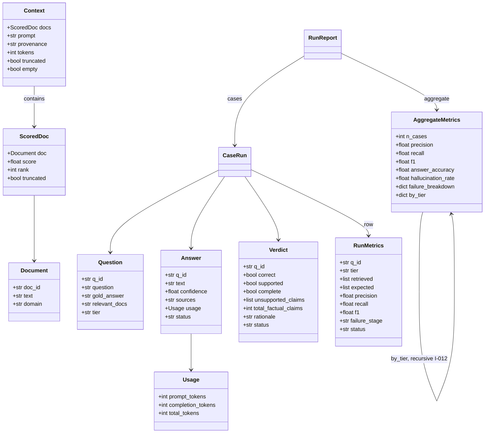
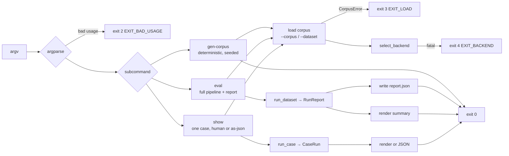
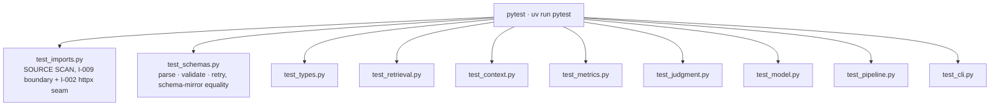

# RAG-Eval — Architecture

R-11 / SPEC §5.1. This document describes *how the code is structured*, in
company with `SPEC.md` (the requirements) and `README.md` (the user guide).
Every design claim below is pinned by a test under `tests/`; identifier suffixes
(`C-0x`, `R-xx`, `§N`, `I-xx`, `E-xx`, `T-xx`) are the same cross-references used
in the code and the spec.

---

## 1. The one-paragraph model

The harness runs a grounded **retrieval → context → answer → verdict** pipeline
(SPEC §13) over a dataset of 25 question/tier cases. Its organizing principle is a
**single hard seam that splits the system into a deterministic core and two
probabilistic roles**:

* **The deterministic boundary** — `retrieval`, `context`, `metrics`, `corpus`,
   `types` — is pure stdlib, network-free, and *bitwise reproducible* for a fixed
   seed (R-15 / I-011). It imports **nothing** LLM-adjacent (I-009, enforced by
   the source-scan `tests/test_imports.py` / T-02).
* **The two probabilistic roles** — `LLM` (answer generation, C-05) and `Judge`
   (LLM-as-judge, C-06) — live behind one interface *each*, with a `Mock*` and an
   `Ollama*` implementation. They are the **only** modules permitted to name the
   Ollama URL shape or import `httpx` (I-002).
* **A shared structured-output gate** (`schemas.generate_structured`) is the
   *only* place raw model text becomes a validated object: `parse → validate →
   error-informed retry`, never fabricating a record (I-010).
* **Orchestration** — `pipeline` (the §13 wiring + fault state machine §3.1) and
   `cli` / `app` (argparse + backend selection + rendering).

Because the probabilistic roles are swappable behind a narrow contract, the same
deterministic core runs **fully offline** (`MockLLM`+`MockJudge`, no model, no
network) or **against a local Ollama model**, producing the exact same report
shape.

---

## 2. Dependency layers

Import direction is acyclic and layered. Arrows point *from dependant → depended
on*. The dashed box is the **deterministic boundary** (I-009): stdlib only, the
single thing that makes the system swappable and reproducible.



**Boundary rule (I-009 / T-02):** `retrieval`, `context`, `metrics`, `corpus`
may import **only** the records from `types`. `model.py` and `judgment.py` are the
*only* modules that may import `httpx` (the Ollama transport) — this is the
"provider seam" from ch1. `jsonschema` lives solely in `schemas.py`, the shared
gate. `tests/test_imports.py` is a source scan asserting exactly this.

---

## 3. The per-case pipeline (§13) — the fault state machine (§3.1)

Each question traverses five stages. **Retrieval and context are deterministic**;
**generation and judging are probabilistic**. A fault at any pre-terminal stage is
*recorded* as a case-level ERROR/PARTIAL — it is **never** a process crash and it
**never** aborts the dataset (run-all default, §3.1). Only a *backend* fault
(`OllamaError`, `ModelNotFoundError`) propagates to the CLI for exit-code mapping.



**Status semantics** (the two orthogonal axes the CLI and report surface):

| `status` | meaning | when |
| --- | --- | --- |
| `SCORED` | fully ok | every stage completed (or `--judge off` retrieval-only) |
| `PARTIAL` | retrieval+generation ok, **judge failed** | a judge fault — retrieval metrics still emitted |
| `ERROR` | a pre-judge stage failed | `failure_stage in {retrieval, context, generation}` |

`failure_stage in {None (=ok), retrieval, context, generation, judging, cancelled}`
is the R-12 fault-stage the `failure_breakdown` aggregates over. The pipeline
(`pipeline.py: run_case`) is the *only* place this mapping happens; `metrics.py`
just reads it.

The **graceful-degradation** property is the design goal: a *result*, not a crash.
A single bad case costs one row of `ERROR`/`PARTIAL`, not the whole run. The only
exception is a **backend** fault, which is fatal by design (E-11/E-12).

---

## 4. The structured-output gate (C-05 / ch1 analog)

Both probabilistic roles funnel raw model text through the *same* gate. It is the
single reliability boundary (E-07 / E-10): it **rejects**, never fabricates. A
record exists only when the schema accepts it.



* **Attempts** = `1 initial + max_retries` (`DEFAULT_MAX_RETRIES = 2` → 3 tries).
* **Error-informed retry:** each failed attempt appends `build_retry_directive(...)`
   (the last schema errors + the required fields) to the next prompt, so the model
   *sees* why it failed.
* **Two schemas, `additionalProperties:false`:**
  * `ANSWER_SCHEMA` — `{answer, confidence in [0,1], sources[]}` (C-04 / §19).
  * `VERDICT_SCHEMA` — `{correct, supported, complete,
    unsupported_claims[], total_factual_claims >= 0, rationale}` (C-06 / §19/§20).
* Both are embedded in `schemas.py` and **mirrored** to `schemas/answer.json` /
   `schemas/verdict.json`; a test-suite asserts the two stay equal.
* **Downstream:** exhausted retries → `Answer(status="ERROR")` (→ case `ERROR`) or
   `Verdict(status="ERROR")` (→ case `PARTIAL`). Never an unvalidated dict (I-010).

> **Design coupling worth knowing:** a schema gate is only as good as its prompt. A
> *reasoning* model (e.g. `qwen3` / `gemma` "think" variants) can spend its
> `num_predict` budget on a hidden thinking phase and return **empty** `content`
> even at `temperature=0` — the gate then sees an unparseable string and all
> attempts fail. The budget (`max_tokens`, default 512 in `model.py:chat`) must
> clear the thinking phase for such models; only pure-stdlib doubles are
> unaffected.



---

## 5. Backend selection (E-11 / E-12 / E-13)

`cli.select_backend` chooses one `Backend(llm, judge, label)` before any work. The
policy is **fail-offline-by-default, fail-loud-when-forced**:



* `--mock` → offline doubles.
* No `--model` and Ollama unreachable → **degrade to mock + banner** (not fatal).
* `--model <x>` forced but Ollama down **or** `<x>` unpulled → **fatal**
   `EXIT_BACKEND` (4) + a banner (pull hint via `model_not_found_error`).
* A model counts as "pulled" on an exact tag **or** a same-family tag (matched up
  to the `:`), so `qwen3.8:27b-mlx` matches a pulled `qwen3.8:*` family.

---

## 6. Data model (`types.py`)

Pure records. `Answer`/`Verdict` are non-frozen because their `q_id` is stamped by
the *pipeline* after the model produces them (the LLM/Judge signatures, C-05/C-06,
carry no question id).



* `Question` carries the §15/§18 ground truth; `tier in {easy, multi, synthesis,
  distractor}` (§17), each with a distinct failure regime — `distractor` being the
  interesting one (lexically-similar-but-irrelevant docs that pull precision down).
* `RunMetrics` is *all* per-case metrics (C-07): retrieval fields are populated for
  **every** case that cleared `RETRIEVING` (I-008), so a later fault still yields a
  full retrieval diagnosis.
* `AggregateMetrics` (C-07 / §21) is a pure record — means are computed *into* it by
  `metrics.aggregate`, and `by_tier` recurses one level per populated §17 tier
  (I-012, §9.5 per-tier breakdown).

---

## 7. The CLI (`rag-eval`, SPEC §5.1)

`app.main` is a thin shim over `cli.run`; the logic lives in `cli.py`.



| subcommand | does | probabilistic? |
| --- | --- | --- |
| `gen-corpus` | write a ~100-doc corpus + grounded `questions.json` (R-10/T-01) | no — deterministic, seeded, byte-identical (R-15) |
| `eval` | run the full pipeline over the dataset, emit a metrics report with per-tier breakdown (§9.5); `--judge off` → retrieval-only (R-12) | yes (both roles) |
| `show` | print one case's retrieval + context + answer + verdict (diagnostic; `--as-json`) | yes (one case) |

**Exit codes:** `0` ok · `2` `EXIT_BAD_USAGE` (argparse) · `3` `EXIT_LOAD`
(`CorpusError`) · `4` `EXIT_BACKEND` (forced model unusable). A per-case fault is
a *result in the report*, not an exit code (run-all, §3.1); only a *backend* fault
exits.

Common flags (shared by `eval`/`show`): `--k` (top-k, 5), `--budget`
(retrieval token budget `B_retrieval`, 2000), `--tiers` (§17 subset),
`--model` (Ollama model; default `qwen3.8:27b-mlx`), `--judge on|off`, `--mock`,
`--seed` (42), `--stop-on-error`, `--quiet`, `--corpus`/`--dataset`.

---

## 8. Verification (how each layer is gated)

Each module has a sibling test; a **source scan** enforces the architectural
invariant no unit test can check.



* `tests/test_imports.py` asserts, by source scan, that `retrieval`/`context`/
   `metrics`/`corpus` stay stdlib-only and that **only** `model`/`judgment` import
   `httpx` — the boundary that makes the offline path and reproducibility hold.
* The `Mock*` implementations let the *entire* determinate suite run with no model
  and no network (R-14/T-14), measuring the *metric math* (R-07/08/09) in isolation
  from any model.

---

## 9. Extension seams

* **Swap the model** — drop in another `Ollama*`-family class (or a different
  transport) behind the `LLM`/`Judge` `_raw` signature; nothing downstream changes,
  and the offline path keeps working for CI.
* **Add a GUI (R-13 / §5.2)** — out of scope for v0.1; it would slot in *behind*
  the same pipeline modules (`pipeline.run_case`/`run_dataset`), reusing every
  record unchanged.
* **Tighten the gate** — `max_retries`, `MAX`/`MIN` in the schemas, or a stricter
   `build_retry_directive`; all localized to `schemas.py` + the two role prompts.

---

### Layout

```
src/rag_eval/
  app.py             # console entry (shim → cli.run)
  cli.py             # argparse · select_backend · cmd_* · render
  pipeline.py        # run_case (§13 state machine) · run_dataset · CaseRun/RunReport
  model.py           # LLM: MockLLM / OllamaLLM · OllamaClient (the httpx seam)
  judgment.py        # Judge: MockJudge / OllamaJudge
  schemas.py         # generate_structured gate · ANSWER/VERDICT schemas · jsonschema
  retrieval.py       # BM25Retriever (deterministic)
  context.py         # build_context · est_tokens (deterministic)
  metrics.py         # retrieval_pr · aggregate (deterministic)
  corpus.py          # generate_corpus(_and_questions) · load_* (deterministic, seeded)
  types.py           # the shared record dataclasses
schemas/answer.json  verdict.json    # mirrors of the embedded schemas
tests/                # one module per source module + test_imports source scan
```
