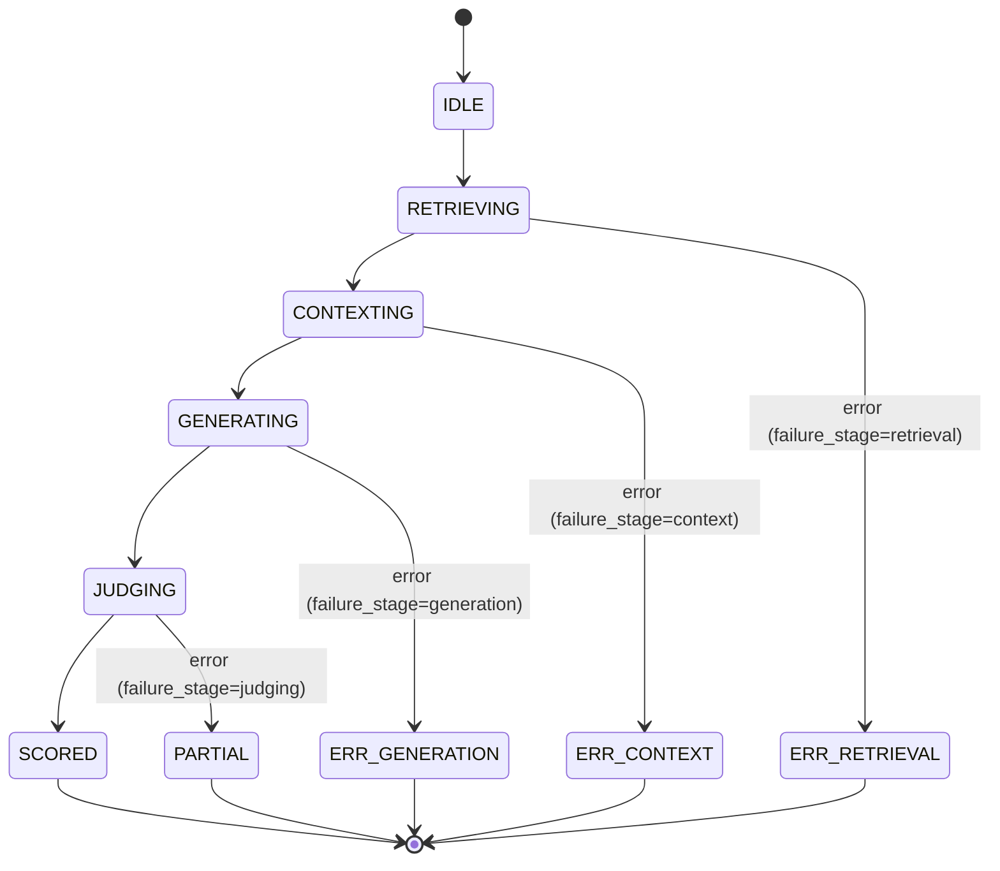
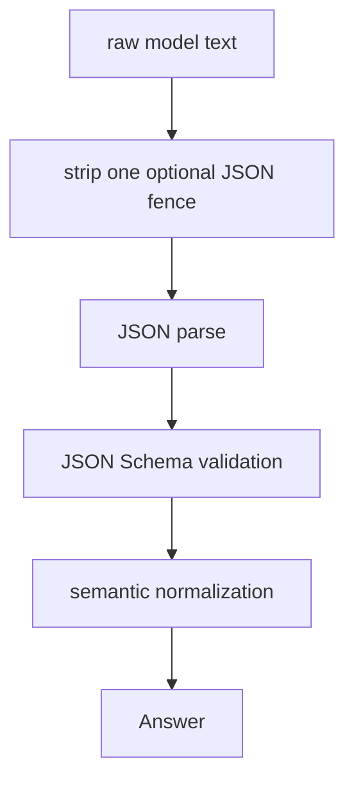
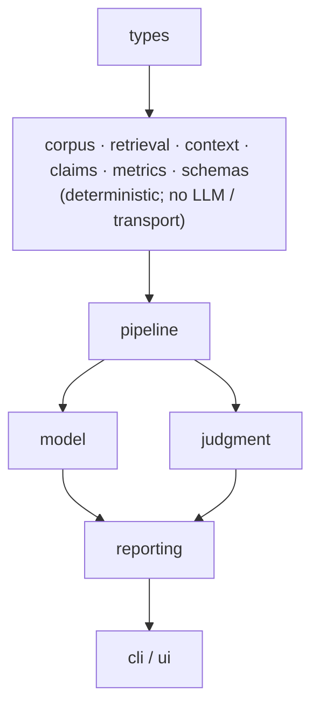

# SPECIFICATION — RAG Eval Harness (BM25 + LLM-as-judge + uv)

> **Status:** v0.2 — Level 3 implementation specification
>
> **Language:** Python 3.12 | Retrieval: pure-Python BM25 | GUI: PyQt5 (optional) | HTTP: httpx |
> Schema: JSON Schema | LLM: local Ollama
>
> **Curriculum source:** `curriculum/week1/chapter2.md` (§15 An Experimental System, §16 Start
> With Easy Questions, §17 Increase the Difficulty, §18 Retrieval Metrics, §19 Answer Accuracy,
> §20 Hallucination Rate, §21 The Context Engineering Creates an Eval Loop).
>
> **Scope:** This document is the authoritative specification of an AI-native RAG evaluation
> system. It is Level 3: implementation behavior, interfaces, invariants, evaluation semantics,
> edge cases, failure semantics, and acceptance tests are explicit enough that a coding agent can
> implement and verify the system with minimal inference.
>
> **Normative language:** "MUST", "MUST NOT", "SHALL", and "SHALL NOT" are normative.
> "SHOULD" denotes a strong recommendation. "MAY" denotes an optional behavior.
>
> **Principle:** requirements express intent; this specification operationalizes that intent into
> observable behavior and explicit conditions under which the implementation is considered correct.

---

## 0. Intent and purpose

Chapter 2's central lesson is that application quality is a property of the **context presented to
the model**, not merely of the prompt:

> `LLM Application = State + Retrieval + Context Construction + Model + Tools + Evaluation`

This lab is the experimental system of §15–§21: a small but measurable retrieval-augmented generation
pipeline plus the evaluation loop that turns it into an engineering artifact rather than a demo.

For each question, the system:

1. validates the question and ground truth;
2. retrieves documents using deterministic BM25;
3. constructs a bounded, provenance-preserving context;
4. asks a local LLM for a structured grounded answer;
5. asks an evaluator to judge correctness, completeness, and support;
6. derives retrieval and answer metrics;
7. records enough provenance and diagnostics to explain failures.

The system deliberately separates:

**Deterministic boundary**

- corpus/question loading and validation;
- BM25 retrieval;
- context construction;
- claim/provenance normalization performed by the harness;
- metric arithmetic;
- report generation;
- mock generation/judging;
- test orchestration.

**Probabilistic boundary**

- answer generation by the local LLM;
- answer judging by the evaluator LLM.

The LLM boundary is isolated behind interfaces and replaced with deterministic doubles for the full
automated suite. The real path uses Ollama by default with `qwen3.8:27b-mlx`.

The central engineering objective is not merely to obtain a high score. It is to make it observable
whether a failure occurred because:

- retrieval failed to surface evidence;
- context construction removed or truncated needed evidence;
- generation failed or ignored available evidence;
- judging failed or returned invalid output.

---

## 1. Goals and non-goals

### 1.1 Goals

The system SHALL:

- implement deterministic lexical BM25 retrieval;
- construct a deterministic, token-bounded context;
- preserve document provenance through retrieval, context, answer, and judgment;
- produce structured answers and structured judgments;
- define correctness, completeness, support, and hallucination semantics explicitly;
- compute retrieval precision, recall, and F1;
- compute answer accuracy and hallucination rate;
- report results overall and by difficulty tier;
- attribute failures to a specific pipeline stage;
- run the complete automated test suite offline;
- support a real local Ollama smoke path;
- provide an optional GUI using the same pipeline modules;
- produce reproducible mock-path results from fixed inputs and seed;
- retain execution provenance so reports can be compared across runs.

### 1.2 Non-goals for v0.2

The system SHALL NOT include:

- dense embeddings;
- vector databases;
- hybrid retrieval;
- web crawling;
- large-document chunking;
- conversation history;
- persistent memory;
- model-driven tool-calling loops;
- default parallel inference;
- cloud model APIs;
- training or fine-tuning.

These are explicit extension points, not hidden requirements.

---

## 2. Actors and responsibilities

| Actor | Responsibility |
| --- | ----------- |
| User | Runs evaluations and/or inspects an individual case through the GUI/CLI. |
| Corpus Loader | Loads and validates documents. |
| Question Loader | Loads and validates questions and ground truth against the corpus. |
| BM25 Retriever | Deterministically ranks corpus documents for a query. |
| Context Builder | Deduplicates, budgets, truncates, labels, and preserves provenance. |
| Answer Generator | Produces a structured answer from question + context. |
| Judge | Evaluates the answer against question, gold answer, and context. |
| Metrics Engine | Computes deterministic retrieval and answer metrics. |
| Pipeline | Orchestrates stages and produces an `EvaluationCase`. |
| CLI | Provides reproducible batch and diagnostic execution. |
| GUI | Provides one-question interactive inspection using the same pipeline. |
| Ollama | External local inference runtime for generation/judging on the real path. |

The UI layers SHALL NOT implement retrieval, metric, or judgment semantics independently.

---

## 3. Requirements

| ID | Requirement |
| --- | ----------- |
| R-01 | The system SHALL implement `question → retrieval → context → generation → judgment → metrics`. |
| R-02 | Retrieval SHALL be deterministic lexical BM25 with no network or LLM dependency. |
| R-03 | Context construction SHALL be deterministic, provenance-preserving, and bounded by `token_budget`. |
| R-04 | Every answer source ID SHALL refer to a document actually included in the final context. |
| R-05 | Every factual claim classified as supported SHALL have explicit evidence mapping to one or more included document IDs. |
| R-06 | Answer generation SHALL use a schema-validated `{answer, confidence, sources}` object. |
| R-07 | Judgment SHALL use an explicitly defined claim-level rubric and schema. |
| R-08 | Claim-level support and hallucination arithmetic SHALL be deterministically derivable from structured judgment output. |
| R-09 | Retrieval precision, recall, and F1 SHALL be computed from `relevant_docs` ground truth. |
| R-10 | Answer accuracy SHALL be the mean of the `correct` field over successfully judged cases. |
| R-11 | Hallucination rate SHALL be `unsupported_claims / total_factual_claims` using claim records emitted by the judge. |
| R-12 | Results SHALL include overall and per-tier metrics. |
| R-13 | Every non-successful case SHALL contain a stage-specific failure classification. |
| R-14 | The automated test suite SHALL run fully offline using deterministic doubles. |
| R-15 | Fixed input + fixed parameters + fixed seed SHALL yield byte-stable mock-path artifacts. |
| R-16 | The real path SHALL use Ollama and SHALL never silently substitute a mock when the operator explicitly requested a real model. |
| R-17 | CLI and GUI SHALL share the same retrieval, context, generation, judgment, and metrics semantics. |
| R-18 | Evaluation reports SHALL contain execution provenance sufficient to distinguish runs by corpus, dataset, implementation, and parameters. |
| R-19 | The specification SHALL distinguish retrieval truncation, deduplication, and partial-document inclusion. |
| R-20 | Synthetic benchmark generation SHALL be treated as a test fixture generator, not as evidence of external benchmark validity; a curated sanity set SHALL also exist. |

---

## 4. State model

### 4.1 Per-case state machine

Each question executes independently.



A terminal state SHALL be one of:

- `SCORED`
- `PARTIAL`
- `ERROR`

A case failure MUST NOT corrupt subsequent cases.

### 4.2 State semantics

| State | Meaning | Terminal |
| --- | ----------- | --- |
| `IDLE` | Scheduled but not started. | No |
| `RETRIEVING` | BM25 search is executing. | No |
| `CONTEXTING` | Context construction is executing. | No |
| `GENERATING` | Answer model is being invoked. | No |
| `JUDGING` | Judge model is being invoked. | No |
| `SCORED` | Retrieval, context, generation, and judgment all succeeded. | Yes |
| `PARTIAL` | Retrieval/context/generation succeeded; judgment failed. | Yes |
| `ERROR` | A stage before judgment failed. | Yes |

### 4.3 Transition rules

1. A case SHALL enter `CONTEXTING` only after successful retrieval.
2. A case SHALL enter `GENERATING` only after successful context construction.
3. A case SHALL enter `JUDGING` only after a schema-valid answer is obtained.
4. Parse/schema failures SHALL retry according to §8.
5. A generation failure SHALL preserve retrieval/context diagnostics.
6. A judgment failure SHALL preserve retrieval/context/generation diagnostics and produce `PARTIAL`.
7. `--stop-on-error` MAY terminate the overall run after the first terminal error, but the default is run-all.

---

## 5. Data contracts

### C-01 Document

```python
@dataclass(frozen=True)
class Document:
    doc_id: str
    text: str
    domain: str | None = None
```

Normative rules:

- `doc_id` MUST be non-empty after stripping whitespace.
- `doc_id` MUST be unique within a corpus.
- `text` MUST be a string.
- Empty text is legal but MUST be retained as a document and SHALL never contribute a positive BM25 score.
- File-based corpus loading SHALL use the filename stem as the default `doc_id`.
- Duplicate IDs SHALL be a load-time error.

### C-02 Question

```python
@dataclass(frozen=True)
class Question:
    q_id: str
    question: str
    gold_answer: str
    relevant_docs: tuple[str, ...]
    tier: Literal["easy", "multi", "synthesis", "distractor"]
```

Normative rules:

- `q_id`, `question`, and `gold_answer` MUST be non-empty after stripping.
- `relevant_docs` MUST be non-empty and contain unique corpus IDs.
- `tier` MUST be one of the four defined values.
- Every `relevant_docs` ID MUST exist in the loaded corpus.
- Question order in a dataset is significant for reproducible report ordering.

### C-03 Scored document

```python
@dataclass(frozen=True)
class ScoredDoc:
    doc: Document
    score: float
    rank: int
```

Rules:

- `score` MUST be finite and `>= 0.0`.
- `rank` starts at 1 and increases by one.
- Search results are sorted by `score DESC`, then `doc_id ASC`.

### C-04 Context and provenance

```python
@dataclass(frozen=True)
class ContextItem:
    doc_id: str
    source_text: str
    source_rank: int
    source_score: float
    included_tokens: int
    full_document: bool
```

```python
@dataclass(frozen=True)
class Context:
    items: tuple[ContextItem, ...]
    prompt: str
    provenance: tuple[str, ...]
    tokens: int
    budget: int
    deduplicated_count: int
    budget_dropped_count: int
    partial_document_count: int
```

Normative rules:

- `provenance` MUST equal the `doc_id` sequence of `items`.
- `Context.tokens <= Context.budget`.
- `prompt` MUST contain every included source label.
- Source labels SHALL use the exact format `[doc_id]`.
- Deduplication and budget truncation are separate events.
- `deduplicated_count` counts source documents removed solely because their normalized text duplicates a retained item.
- `budget_dropped_count` counts documents omitted entirely because of the budget.
- `partial_document_count` counts included documents whose text is a strict prefix of the original text.

### C-05 Answer

```python
@dataclass(frozen=True)
class Answer:
    q_id: str
    text: str
    confidence: float
    sources: tuple[str, ...]
    usage: Usage
    status: Literal["COMPLETED", "ERROR"]
```

Normative rules:

- `text` MUST be non-empty for `COMPLETED`.
- `0.0 <= confidence <= 1.0`.
- `sources` MUST contain unique IDs.
- The harness SHALL reject foreign source IDs; they SHALL NOT be passed through as valid provenance.
- A schema-valid answer with an empty `sources` list is legal only when the answer explicitly states that the provided context is insufficient or contains no factual answer.

### C-06 Claim and evidence record

```python
@dataclass(frozen=True)
class Claim:
    claim_id: str
    text: str
    factual: bool
    supported: bool
    source_ids: tuple[str, ...]
```

```python
@dataclass(frozen=True)
class Verdict:
    q_id: str
    correct: bool
    complete: bool
    supported: bool
    claims: tuple[Claim, ...]
    rationale: str
    status: Literal["JUDGED", "ERROR", "SKIPPED"]
```

The `claims` collection is the authoritative basis for hallucination arithmetic.

Derived values:

```python
total_factual_claims = sum(c.factual for c in claims)
unsupported_claims = sum(c.factual and not c.supported for c in claims)
```

`unsupported_claims` and `total_factual_claims` MUST NOT be independently invented by the judge.

---

## 6. Evaluation semantics

This section is normative. It removes semantic discretion that would otherwise be delegated to an implementation agent.

### 6.1 Atomic factual claim

An **atomic factual claim** is the smallest independently verifiable proposition in an answer.

A claim SHALL be split when:

- it contains multiple independently verifiable predicates;
- its clauses could independently be true or false;
- its clauses require different evidence.

A claim SHOULD remain whole when splitting it would create fragments that cannot be independently interpreted.

Examples:

```text
"Policy P permits remote work three days per week."
→ one factual claim.

"Policy P permits remote work three days per week and requires manager approval."
→ two factual claims.
```

Non-factual content includes:

- opinions;
- hedges that add no factual proposition;
- conversational filler;
- statements of uncertainty such as "I cannot determine this from the supplied documents."

### 6.2 Support

A factual claim is **supported** iff:

1. `supported=True`;
2. `source_ids` is non-empty;
3. every `source_id` exists in `Context.provenance`;
4. the cited source text entails or directly states the claim.

A source merely sharing terminology with the claim is insufficient.

The harness SHALL enforce conditions 2 and 3 deterministically. Semantic condition 4 is the judge's responsibility.

A verdict SHALL NOT have `supported=True` when any factual claim has `supported=False`.

### 6.3 Correctness

An answer is **correct** iff:

1. every required proposition represented by `gold_answer` is correctly represented in the answer;
2. no answer proposition materially contradicts the gold answer;
3. the answer is not merely related to the subject; it answers the actual question.

Paraphrase and equivalent wording are allowed.

Exact string matching is NOT required.

A refusal such as "I cannot answer from the provided documents" is correct only when the available evidence genuinely does not establish the requested answer.

### 6.4 Completeness

An answer is **complete** iff every required proposition in `gold_answer` is represented.

`relevant_docs` defines the evidence universe, not a requirement to repeat every sentence or fact contained in those documents.

The judge SHALL evaluate completeness against the required answer propositions, not against raw document length.

### 6.5 Contradiction

An answer containing a materially contradictory factual claim SHALL be `correct=False`, even if some other claims are correct.

A contradiction SHALL also be represented as a factual claim.

### 6.6 Hallucination

A hallucination is an unsupported factual claim:

```text
hallucination_rate =
    unsupported factual claims
     -------------------------
      total factual claims
```

When `total_factual_claims == 0`, the rate is exactly `0.0`.

The rate SHALL be computed by the harness from `claims`, not accepted as a numeric field produced by the judge.

---

## 7. Corpus and benchmark dataset

### 7.1 Corpus loader

```python
def load_corpus(path: str | Path) -> list[Document]:
    ...
```

Accepted inputs:

- directory of `.txt` files;
- a single `.jsonl` file.

Errors:

- unreadable file;
- malformed JSONL;
- duplicate `doc_id`;
- invalid document record;
- unsupported input path.

All such errors are load-time errors.

### 7.2 Generated benchmark

```python
def generate_corpus_and_questions(
    out_dir: str | Path,
    *,
    n_docs: int = 100,
    n_questions: int = 25,
    seed: int = 42,
) -> None:
    ...
```

The generated benchmark SHALL contain:

- 100 distinct short documents by default;
- 25 questions by default;
- all four tiers;
- non-empty ground truth;
- lexical distractors;
- multi-document and synthesis questions.

The generator SHALL be deterministic under a fixed seed.

### 7.3 Curated sanity benchmark

The repository SHALL also contain a small hand-authored fixture:

- at least 10 documents;
- at least 5 questions;
- all four relevant retrieval regimes represented where practical;
- manually inspectable gold answers and `relevant_docs`.

The curated fixture is the normative sanity benchmark for semantics. The generated 100-document set
is the scale/performance benchmark.

This prevents the generator from being the sole authority on whether the benchmark itself is valid.

---

## 8. Retrieval contract

### 8.1 BM25 configuration

```python
class BM25Retriever:
    def __init__(
        self,
        documents: list[Document],
        *,
        k1: float = 1.5,
        b: float = 0.75,
        stop_words: frozenset[str] | None = None,
        keep_numbers: bool = False,
    ) -> None:
        ...
```

Constraints:

- `k1 >= 0`.
- `0 <= b <= 1`.
- empty corpus is legal and produces no results.

### 8.2 Tokenizer

The tokenizer SHALL:

1. lowercase using Python Unicode `str.lower()`;
2. split on `[^\w']+`;
3. discard empty tokens;
4. discard pure-numeric tokens unless `keep_numbers=True`;
5. apply the optional exact stop-word set;
6. preserve deterministic list order.

No stemming or lemmatization SHALL occur.

### 8.3 BM25 formula

$$
score(q,d)=\sum_{t\in q}idf(t)
\cdot
\frac{tf(t,d)(k_1+1)}
{tf(t,d)+k_1(1-b+b|d|/avgdl)}
$$

$$
idf(t)=\ln\left(1+\frac{N-n(t)+0.5}{n(t)+0.5}\right)
$$

Repeated query terms MAY be reduced to unique query terms; the implementation SHALL use unique query
terms for v0.2.

### 8.4 Ranking

Results SHALL be ordered:

1. `score` descending;
2. `doc_id` ascending for equal scores.

`search(query, k)`:

- rejects `k < 1`;
- returns at most `k` results;
- returns `[]` for an empty query or corpus;
- never raises merely because fewer than `k` documents match.

---

## 9. Context construction

### 9.1 Normalization for deduplication

Text normalization for dedupe SHALL:

- Unicode-normalize with NFC;
- strip leading/trailing whitespace;
- collapse every run of internal whitespace to one ASCII space;
- compare case-insensitively.

The normalized text SHALL be used only for deduplication. Original source text is preserved for display.

### 9.2 Dedupe

When `dedupe=True`:

- documents with identical normalized text form one equivalence class;
- the highest-ranked member is retained;
- equal-score ties use `doc_id ASC`;
- `deduplicated_count` increments once for every omitted duplicate document.

Deduplication SHALL NOT set `budget_dropped_count`.

### 9.3 Token estimator

For v0.2:

```python
est_tokens(text) = ceil(len(text) / 4)
```

This is a deterministic character-based estimate, not a model tokenizer.

The estimate SHALL be used consistently by context construction and reporting.

For source blocks, the estimate SHALL be applied to the **actual emitted prompt text**, including source labels and
formatting.

### 9.4 Context assembly

Inputs are already rank ordered.

For each candidate in order:

1. construct its source-labeled block;
2. determine whether the entire block fits;
3. if it fits, include it;
4. if the full block does not fit:
   - if the remaining budget is greater than zero, include the longest prefix that fits;
   - mark `full_document=False`;
   - increment `partial_document_count`;
   - all remaining lower-ranked documents are omitted;
   - count each omitted document in `budget_dropped_count`;
5. stop once no remaining budget exists.

The partial prefix SHALL end at a Unicode-safe character boundary and SHOULD end at the nearest prior
whitespace boundary.

The implementation SHALL never emit text exceeding the requested budget.

This greedy policy is intentionally deterministic.

### 9.5 Context state invariants

- `tokens <= budget`.
- `provenance == tuple(item.doc_id for item in items)`.
- `deduplicated_count >= 0`.
- `budget_dropped_count >= 0`.
- `partial_document_count >= 0`.
- `truncated` is NOT stored; it is derived as:

```python
truncated = (
    deduplicated_count > 0
    or budget_dropped_count > 0
    or partial_document_count > 0
)
```

This prevents deduplication, omission, and partial inclusion from being conflated.

---

## 10. Answer generation

### 10.1 LLM interface

```python
class LLM(ABC):
    @property
    def model_id(self) -> str:
        ...

    @abstractmethod
    def generate(
        self,
        *,
        system: str,
        context: str,
        question: str,
        schema: dict,
        max_tokens: int = 512,
        temperature: float = 0.0,
        seed: int | None = 42,
        max_retries: int = 2,
    ) -> Answer:
        ...
```

### 10.2 Structured output protocol

The real model SHALL be prompted to emit exactly one JSON object.

Validation pipeline:



The harness SHALL NOT accept an unvalidated object.

### 10.3 Retry semantics

On parse or schema failure:

- retry up to `max_retries`;
- include the prior failure description in the retry directive;
- preserve the first failure reason in the final diagnostics;
- after exhaustion, return `Answer(status="ERROR")`.

Retries SHALL NOT mutate the question or context.

### 10.4 Source normalization

Given generated `sources`:

- duplicate IDs SHALL be removed while preserving first occurrence;
- foreign IDs SHALL be removed;
- `grounding_violation=True` SHALL be recorded if any foreign ID was supplied;
- a foreign-source violation SHALL force `supported=False` at the judgment layer.

The harness SHALL never silently convert a foreign source into valid provenance.

---

## 11. Judge contract

### 11.1 Judge input

The judge receives:

- `Question`;
- final `Context`;
- generated `Answer`;
- gold answer;
- retrieved and expected document IDs.

### 11.2 Judge output schema

Normative JSON:

```json
{
  "correct": true,
  "complete": true,
  "supported": true,
  "claims": [
    {
      "claim_id": "c1",
      "text": "Policy P permits remote work three days per week.",
      "factual": true,
      "supported": true,
      "source_ids": ["policy-17"]
    }
  ],
  "rationale": "..."
}
```

Schema requirements:

- `additionalProperties: false`;
- `correct`, `complete`, `supported` are required booleans;
- `claims` is required and is an array;
- each claim requires `claim_id`, `text`, `factual`, `supported`, `source_ids`;
- `claim_id` values are unique within a verdict;
- `source_ids` values are unique within a claim;
- claim source IDs MUST be a subset of `Context.provenance`;
- `rationale` is required and MUST be a string.

### 11.3 Deterministic post-validation

The harness SHALL derive:

```python
derived_supported = all(
    (not c.factual) or c.supported
    for c in claims
)
```

and SHALL require:

```python
verdict.supported == derived_supported
```

If the model's top-level `supported` disagrees with claim-level evidence, the result SHALL be rejected
and retried as schema/semantic invalidity.

Likewise:

```python
total_factual_claims = sum(c.factual for c in claims)
unsupported_claims = sum(c.factual and not c.supported for c in claims)
```

No model-supplied count is trusted.

### 11.4 Correctness and completeness rubric

The judge SHALL be instructed to evaluate:

1. required propositions implied by `gold_answer`;
2. whether each required proposition is represented;
3. whether any materially contradictory proposition appears;
4. whether the answer's factual claims have evidence in the final context.

The judge SHALL NOT mark an answer complete merely because it cites all `relevant_docs`.

---

## 12. Metrics

### 12.1 Retrieval metrics

For expected document ID set `E` and retrieved ID set `R`:

$$
\begin{aligned}
TP &= |E \cap R| \\
FP &= |R \setminus E| \\
FN &= |E \setminus R|
\end{aligned}
$$

$$
\begin{aligned}
P &= \dfrac{TP}{TP + FP} \\
R &= \dfrac{TP}{TP + FN} \\
F_1 &= \dfrac{2PR}{P + R}
\end{aligned}
$$

Guards:

- if `TP + FP == 0`, precision is `None`;
- if `TP + FN == 0`, recall is `None`;
- if `P + R == 0`, F1 is `0.0`.

A row with no retrieval output contributes to neither mean precision nor mean recall.

### 12.2 Answer accuracy

$$
\begin{aligned}
\text{answer\_accuracy} &= \text{mean}(\text{correct for successfully judged rows})
\end{aligned}
$$

Unjudged rows do not contribute.

### 12.3 Hallucination rate

$$
\begin{aligned}
\text{hallucination\_rate} &= \dfrac{\text{sum(unsupported\_claims)}}{\text{sum(total\_factual\_claims)}}
\end{aligned}
$$

over successfully judged rows.

When the denominator is zero, the result is exactly `0.0`.

### 12.4 Aggregation

v0.2 uses **macro-average row metrics** for precision, recall, and F1.

This choice is normative.

The report SHALL distinguish:

- number of cases;
- number of retrieval-scored cases;
- number of judged cases;
- number of failed cases.

### 12.5 Extended retrieval diagnostics

In addition to default `precision/recall/F1` at configured `k`, the harness SHOULD expose:

- `Recall@1`
- `Recall@k`
- `MRR`

These are diagnostic fields and SHALL NOT replace the curriculum's required metrics.

---

## 13. Evaluation case and report contracts

### 13.1 EvaluationCase

```python
@dataclass(frozen=True)
class EvaluationCase:
    question: Question
    retrieved: tuple[ScoredDoc, ...] | None
    context: Context | None
    answer: Answer | None
    verdict: Verdict | None
    metrics: RunMetrics
```

### 13.2 RunMetrics

```python
@dataclass(frozen=True)
class RunMetrics:
    q_id: str
    tier: str

    retrieved: tuple[str, ...]
    expected: tuple[str, ...]
    tp: int
    fp: int
    fn: int
    precision: float | None
    recall: float | None
    f1: float | None

    context_tokens: int | None
    context_budget: int | None
    deduplicated_count: int
    budget_dropped_count: int
    partial_document_count: int

    answer_status: str
    correct: bool | None
    complete: bool | None
    supported: bool | None
    unsupported_claims: int
    total_factual_claims: int
    grounding_violation: bool

    retrieve_ms: float
    generate_ms: float
    judge_ms: float
    total_latency_ms: float

    failure_stage: str | None
    failure_code: str | None
    status: str
```

### 13.3 Failure codes

Stage-independent failure codes SHALL be stable strings, including at least:

- `EMPTY_QUERY`
- `RETRIEVAL_EXCEPTION`
- `CONTEXT_EXCEPTION`
- `BUDGET_TOO_SMALL`
- `GENERATION_PARSE_ERROR`
- `GENERATION_SCHEMA_ERROR`
- `GENERATION_TIMEOUT`
- `OLLAMA_UNREACHABLE`
- `MODEL_NOT_FOUND`
- `JUDGING_PARSE_ERROR`
- `JUDGING_SCHEMA_ERROR`
- `JUDGING_TIMEOUT`
- `GROUNDING_VIOLATION`
- `DATASET_INVALID`

### 13.4 Run provenance

Every report SHALL include:

```json
{
  "spec_version": "0.2",
  "run_id": "...",
  "timestamp_utc": "...",
  "git_commit": "...",
  "python_version": "...",
  "platform": "...",
  "dataset_hash": "...",
  "corpus_hash": "...",
  "retrieval": {
    "k": 5,
    "k1": 1.5,
    "b": 0.75
  },
  "context": {
    "token_budget": 2000,
    "token_estimator": "ceil(len(text)/4)"
  },
  "generation": {
    "model_id": "...",
    "temperature": 0.0,
    "seed": 42,
    "max_tokens": 512,
    "max_retries": 2
  },
  "judge": {
    "model_id": "...",
    "max_retries": 2
  }
}
```

The exact `run_id` and timestamp need not be deterministic; all substantive run inputs and outputs SHALL be.

---

## 14. CLI specification

### 14.1 Command form

```text
rag-eval <command> [options]
```

Commands:

```text
eval
gen-corpus
show
```

### 14.2 `eval`

```text
rag-eval eval [options]
```

Options:

```text
--dataset PATH
--corpus PATH
--out PATH
--k N
--budget N
--tiers LIST
--model NAME
--judge on|off
--mock
--seed N
--max-retries N
--timeout N
--stop-on-error
--quiet
```

Defaults:

```text
dataset: ./questions.json
corpus: ./documents
out: ./report.json
k: 5
budget: 2000
model: qwen3.8:27b-mlx
judge: on
seed: 42
max-retries: 2
timeout: 60
```

### 14.3 Model-selection precedence

1. `--mock` ALWAYS selects mock mode.
2. Explicit `--model NAME` selects real mode and SHALL NOT silently fall back to mock.
3. When no `--model` is supplied, the default model is attempted.
4. If the default real backend is unavailable, the CLI MAY fall back to mock mode and MUST print a banner.
5. An explicitly requested real model that is unavailable SHALL return exit code `4`.

### 14.4 Exit codes

| Code | Meaning |
| --- | --- |
| 0 | Run completed; per-case failures may still be recorded. |
| 2 | Invalid CLI usage or argument values. |
| 3 | Corpus/dataset loading or integrity failure. |
| 4 | Explicit real-model backend failure. |
| 5 | Internal fatal error outside expected per-case failure handling. |

### 14.5 `show`

```text
rag-eval show --q-id Q001 [options]
```

The command SHALL display:

- question;
- retrieved documents and scores;
- included/excluded context documents;
- context token count and budget;
- final prompt;
- generated answer;
- normalized sources;
- claim-level judgment;
- derived metrics;
- failure diagnostics if any.

This command exists specifically to answer:

> "What world did the model actually see?"

---

## 15. GUI specification

The GUI is optional, but when implemented it SHALL reuse the CLI pipeline semantics.

### 15.1 Requirements

- PyQt5;
- one question at a time;
- retrieval executes off the Qt event loop;
- generation and judging execute in the worker;
- UI updates occur through queued Qt signals;
- `Run` is disabled while a run is active;
- `Cancel` is enabled while running;
- cancellation leaves exactly one terminal case state and no live worker.

### 15.2 Panels

The GUI SHALL show:

- question;
- model/mode;
- `k`;
- token budget;
- ranked retrieval with scores;
- context inclusion status;
- dedupe count;
- budget omission count;
- partial-document count;
- context token usage;
- answer;
- confidence;
- normalized source IDs;
- claim-level support;
- correct/completeness/support verdicts;
- hallucination rate;
- latency;
- failure stage/code.

### 15.3 Cancel semantics

A cancellation is a user-initiated generation-stage termination for this v0.2 GUI.

The resulting case SHALL be:

```text
status = ERROR
failure_stage = generation
failure_code = GENERATION_CANCELLED
```

The worker SHALL be stopped and joined before the GUI returns to idle.

---

## 16. Failure and edge-case semantics

| ID | Situation | Required behavior |
| -- | ---- | ----------- |
| E-01 | Empty corpus | Load succeeds; retrieval returns `[]`; evaluation records zero retrieval matches. |
| E-02 | Empty/blank question | CLI argument validation error or dataset integrity error; no model call. |
| E-03 | `k > corpus size` | Return all eligible matches; no error. |
| E-04 | `k < 1` | CLI/API validation error. |
| E-05 | No lexical matches | Retrieval result is `[]`; context is empty; retrieval metrics still computed. |
| E-06 | All retrieved docs irrelevant | Valid result with `TP=0`, `FP>0`, `FN>0`. |
| E-07 | Duplicate texts | Deduplicate deterministically; do not mark as budget omission. |
| E-08 | Token budget smaller than first source block | Emit a deterministic partial prefix if remaining budget is positive; otherwise emit no item. |
| E-09 | Context budget exactly filled | No partial item is created if the complete next source fits exactly. |
| E-10 | Malformed answer JSON | Retry, then generation error. |
| E-11 | Answer schema violation | Retry, then generation error. |
| E-12 | Foreign answer source | Strip foreign IDs, record grounding violation, force unsupported. |
| E-13 | Judge schema violation | Retry, then partial judgment failure. |
| E-14 | Claim source outside context | Reject verdict, retry; after exhaustion judgment fails. |
| E-15 | Judge top-level support disagrees with claims | Retry; after exhaustion judgment fails. |
| E-16 | Ollama unreachable in default mode | Fall back to mock with explicit banner. |
| E-17 | Explicitly requested model unreachable | Exit 4; no mock substitution. |
| E-18 | Model not pulled | Explicit error including `ollama pull NAME`. |
| E-19 | Missing ground-truth document | Load-time dataset failure; exit 3. |
| E-20 | Judge skipped | `status=PARTIAL` or `SKIPPED` semantics are reported explicitly; retrieval metrics remain valid. |
| E-21 | Zero factual claims | Hallucination rate is exactly `0.0`. |
| E-22 | No judged rows | `answer_accuracy` and `hallucination_rate` are `None` at aggregate level unless explicitly defined otherwise; report zero judged cases. |
| E-23 | Dataset tier filter matches zero questions | Warning + exit 0 with a valid empty report. |
| E-24 | Generation timeout | Per-case generation failure; prior diagnostics retained. |
| E-25 | Judge timeout | `PARTIAL`; retrieval and generation diagnostics retained. |
| E-26 | GUI Run while active | Prevent duplicate run; optionally request cancel, but exactly one worker may remain active. |
| E-27 | GUI cancel | `ERROR / generation / GENERATION_CANCELLED`; worker fully terminated before idle. |

---

## 17. Invariants

| ID | Invariant | Verification |
| --- | ---------- | --- |
| I-001 | BM25 ordering is score descending, doc ID ascending on ties. | T-04 |
| I-002 | Fixed corpus/query/parameters yield byte-identical retrieval IDs and scores within the supported runtime. | T-05 |
| I-003 | Context token count never exceeds budget. | T-06 |
| I-004 | Context provenance exactly matches included items. | T-07 |
| I-005 | Dedupe count and budget-drop count are separately measurable. | T-08 |
| I-006 | Every answer source ID belongs to context provenance after normalization. | T-09 |
| I-007 | Every claim marked supported has source IDs belonging to context provenance. | T-10 |
| I-008 | Verdict-level support equals the deterministic conjunction of factual claim support. | T-11 |
| I-009 | Hallucination counts are derived from claims, not model-supplied numeric summaries. | T-12 |
| I-010 | No invalid schema object reaches `COMPLETED` or `JUDGED`. | T-13 |
| I-011 | Retrieval/context/metrics modules have no LLM/network dependency. | T-14 |
| I-012 | Automated tests require no Ollama or network. | T-15 |
| I-013 | Missing ground-truth document IDs fail at load time. | T-16 |
| I-014 | Every terminal failure has exactly one `failure_stage` and `failure_code`. | T-17 |
| I-015 | Root aggregates and per-tier aggregates use identical formulas. | T-18 |
| I-016 | Report provenance identifies corpus, dataset, specification, and execution parameters. | T-19 |
| I-017 | Mock-path output is byte-stable for fixed fixture + seed + implementation version. | T-20 |

---

## 18. Constraints

| ID | Constraint | Target |
| --- | --------- | --------- |
| K-01 | Python | `>=3.12,<3.13` |
| K-02 | Full automated suite | `< 90s` on development machine |
| K-03 | Deterministic 100-doc/25-question mock run | `< 5s` target |
| K-04 | No network in deterministic layers | mandatory |
| K-05 | No model download in tests | mandatory |
| K-06 | Default concurrency | 1 |
| K-07 | Default `k` | 5 |
| K-08 | Default context budget | 2000 estimated tokens |
| K-09 | Default `k1` | 1.5 |
| K-10 | Default `b` | 0.75 |
| K-11 | Default retries | 2 |
| K-12 | Default timeout | 60s/model call |
| K-13 | Mock reproducibility | byte-stable |
| K-14 | Real-model reproducibility | best-effort only; exact generated text is not asserted |

---

## 19. Acceptance tests

### 19.1 Dataset and corpus

| ID | Criterion |
| --- | -------- |
| T-01 | Generated benchmark contains exactly 100 unique docs and 25 questions by default. |
| T-02 | Generated benchmark contains all four tiers. |
| T-03 | Two generation runs with the same seed produce byte-identical artifacts. |
| T-04 | Duplicate document IDs fail at load time. |
| T-05 | Missing `relevant_docs` IDs fail at load time. |

### 19.2 Retrieval

| ID | Criterion |
| --- | -------- |
| T-06 | BM25 worked example yields TP=2, FP=2, FN=1, P=0.50, $R\approx 0.667$, $F_1\approx 0.571$. |
| T-07 | Equal-score ranking is deterministic by `doc_id`. |
| T-08 | Empty corpus, empty query, `k=1`, `k>corpus`, and all-irrelevant cases behave as specified. |

### 19.3 Context

| ID | Criterion |
| --- | -------- |
| T-09 | Context never exceeds budget. |
| T-10 | Dedupe retains highest-ranked identical-text document and counts one deduplication. |
| T-11 | Partial source inclusion is deterministic and stays within budget. |
| T-12 | Exact-fit source is included whole and is not marked partial. |
| T-13 | Provenance matches included context items exactly. |

### 19.4 Schema and grounding

| ID | Criterion |
| --- | -------- |
| T-14 | Invalid answer JSON is retried and eventually fails with generation error. |
| T-15 | Invalid answer confidence fails schema validation. |
| T-16 | Foreign answer source is stripped and grounding violation recorded. |
| T-17 | Invalid judge schema retries and eventually produces partial judgment failure. |
| T-18 | A judge verdict citing a document outside context is rejected. |
| T-19 | Top-level `supported` inconsistent with claim-level support is rejected. |

### 19.5 Claim semantics and metrics

| ID | Criterion |
| --- | -------- |
| T-20 | Multi-clause answer is decomposed into independently testable factual claims according to the rubric. |
| T-21 | All-supported answer has hallucination rate `0.0`. |
| T-22 | One unsupported factual claim among four yields hallucination rate `0.25`. |
| T-23 | Zero factual claims yields hallucination rate `0.0`. |
| T-24 | Correctness accepts semantically equivalent paraphrase and rejects contradiction. |
| T-25 | Completeness fails when a required gold proposition is omitted. |
| T-26 | Aggregate answer accuracy uses judged rows only. |
| T-27 | Aggregate retrieval metrics use non-None per-row values only. |
| T-28 | Per-tier aggregation uses the same formulas as root aggregation. |

### 19.6 Failure handling

| ID | Criterion |
| --- | -------- |
| T-29 | Retrieval failure produces `ERROR/retrieval`. |
| T-30 | Context failure produces `ERROR/context` and preserves retrieval metrics. |
| T-31 | Generation failure produces `ERROR/generation` and preserves retrieval/context diagnostics. |
| T-32 | Judge failure produces `PARTIAL/judging` and preserves retrieval/generation diagnostics. |
| T-33 | Every terminal failure has exactly one stage and code. |

### 19.7 Offline behavior

| ID | Criterion |
| --- | -------- |
| T-34 | `uv run pytest` passes with Ollama unavailable. |
| T-35 | No deterministic module imports `httpx`, `Ollama`, `LLM`, or `Judge`. |
| T-36 | Mock full-pipeline run is byte-stable under fixed fixture and seed. |

### 19.8 CLI and report

| ID | Criterion |
| --- | -------- |
| T-37 | `rag-eval eval --mock` creates valid JSON report and human summary. |
| T-38 | `rag-eval show --q-id Q001` exposes retrieved/context/answer/judge details. |
| T-39 | Explicit `--model` failure returns exit 4 and does not silently mock. |
| T-40 | Report contains required provenance fields. |
| T-41 | Zero-match tier filter creates valid empty report with exit 0. |

### 19.9 GUI

| ID | Criterion |
| --- | -------- |
| T-42 | GUI executes pipeline off the Qt event loop. |
| T-43 | GUI shows retrieval scores and context budget state. |
| T-44 | GUI cancel terminates worker and leaves no live worker. |
| T-45 | GUI and CLI produce equivalent pipeline semantics for the same case in mock mode. |

### 19.10 Performance smoke

| ID | Criterion |
| --- | -------- |
| T-46 | Generated benchmark creation meets target. |
| T-47 | Mock evaluation meets K-03 target. |
| T-48 | Full test suite meets K-02 target on development machine. |

---

## 20. Manual real-model smoke evaluation

The automated suite never requires Ollama.

Manual validation SHALL include:

```bash
uv run rag-eval gen-corpus --seed 42
uv run pytest
uv run rag-eval eval --mock --seed 42
uv run rag-eval eval --model qwen3.8:27b-mlx --seed 42
uv run rag-eval show --q-id Q001 --model qwen3.8:27b-mlx
uv run rag-gui
```

The human SHALL inspect at least:

- one easy case;
- one multi-document case;
- one synthesis case;
- one distractor case;
- one case where context truncation occurs;
- one case where the model declines to answer from insufficient evidence.

The comparison between mock and real runs is diagnostic; it is not a claim that the mock predicts model
quality.

---

## 21. Architecture

### 21.1 Proposed layout

```text
src/rag_eval/
  types.py
  corpus.py
  retrieval.py
  context.py
  claims.py
  metrics.py
  model.py
  judgment.py
  schemas.py
  pipeline.py
  reporting.py
  cli.py
  ui.py
  app.py

schemas/
  answer.json
  verdict.json

fixtures/
  curated/
    documents/
    questions.json

tests/
  test_corpus.py
  test_retrieval.py
  test_context.py
  test_claims.py
  test_schemas.py
  test_judgment.py
  test_metrics.py
  test_pipeline.py
  test_reporting.py
  test_cli.py
  test_gui.py
  conftest.py

documents/
questions.json
```

### 21.2 Dependency direction



The deterministic modules MUST NOT depend on model or transport implementations.

### 21.3 LLM isolation

Only:

- `model.py`
- `judgment.py`

may contain Ollama transport details.

No other module may import:

- `httpx`;
- Ollama URLs;
- Ollama model names;
- model-specific client classes.

---

## 22. Reproducibility protocol

A result is reproducible when the following are held constant:

- specification version;
- implementation commit;
- Python version;
- corpus bytes;
- question dataset bytes;
- retrieval parameters;
- context parameters;
- mock seed;
- generation parameters;
- judge parameters.

The mock path SHALL produce byte-identical:

- retrieved IDs;
- scores;
- context text;
- answers;
- claim records;
- verdicts;
- metrics;
- report JSON ordering.

The real path SHALL be considered best-effort reproducible only. Exact free-form generated text is not asserted.

---

## 23. Traceability matrix

| Requirement | Contract / Design | Acceptance |
| --- | --- | --- |
| R-01 | §4, §21 | T-37 |
| R-02 | §8 | T-06–T-08 |
| R-03 | §9 | T-09–T-13 |
| R-04 | §10.4 | T-16 |
| R-05 | §11.3 | T-18–T-19 |
| R-06 | §10 | T-14–T-15 |
| R-07 | §11 | T-17–T-19 |
| R-08 | §6, §12 | T-20–T-23 |
| R-09 | §12.1 | T-06 |
| R-10 | §12.2 | T-26 |
| R-11 | §12.3 | T-21–T-23 |
| R-12 | §12.4, §13 | T-28 |
| R-13 | §13.3, §16 | T-29–T-33 |
| R-14 | §10, §18 | T-34–T-36 |
| R-15 | §22 | T-03, T-36 |
| R-16 | §14.3, §16 | T-39 |
| R-17 | §15, §21 | T-45 |
| R-18 | §13.4 | T-40 |
| R-19 | §9 | T-10–T-12 |
| R-20 | §7.3 | T-01–T-03 |

---

## 24. Definition of done

The implementation is complete for v0.2 only when all of the following are true:

1. `uv run pytest` passes with no Ollama daemon and no network.
2. All Level-3 invariants in §17 have automated verification.
3. All acceptance criteria T-01 through T-48 are implemented and passing or explicitly designated
   manual-only where stated.
4. `rag-eval eval --mock` produces a valid report.
5. `rag-eval show` displays a complete case trace.
6. The curated benchmark passes its semantic sanity checks.
7. The generated benchmark is reproducible.
8. The real Ollama smoke path succeeds on a machine with the required model.
9. The GUI, if included, passes its offscreen tests and manual smoke.
10. No requirement is implemented only in prose outside this specification.
11. No acceptance test is referenced by the traceability matrix without a corresponding test definition.
12. The report contains enough provenance to explain exactly which implementation and data produced it.

---

## 25. Future extensions

Explicitly deferred:

- dense retriever behind the same retriever interface;
- hybrid retrieval;
- configurable rerankers;
- real model tokenizers;
- concurrency;
- persistent evaluation database;
- HTML dashboard;
- statistical confidence intervals;
- inter-judge agreement;
- multiple judge models;
- adversarial benchmark generation;
- externally curated datasets;
- claim-level evidence spans rather than source-document IDs.

Each extension SHALL preserve the Level-3 contracts unless a new specification version changes them.

---

## 26. Versioning and change control

This specification is the source of truth.

Any implementation change that affects:

- observable behavior;
- interface shape;
- semantics;
- invariants;
- failure codes;
- metrics;
- report format;
- CLI behavior

MUST update this document and its traceability/acceptance tests in the same change.

A change that modifies evaluation semantics SHALL increment the specification minor or major version as appropriate.

---

*End of specification.*

*This v0.2 specification preserves the original Chapter 2 scope while making the previously implicit
evaluation semantics, provenance model, truncation behavior, failure precedence, reproducibility, and
verification coverage explicit enough for Level-3 implementation by a coding agent.*
