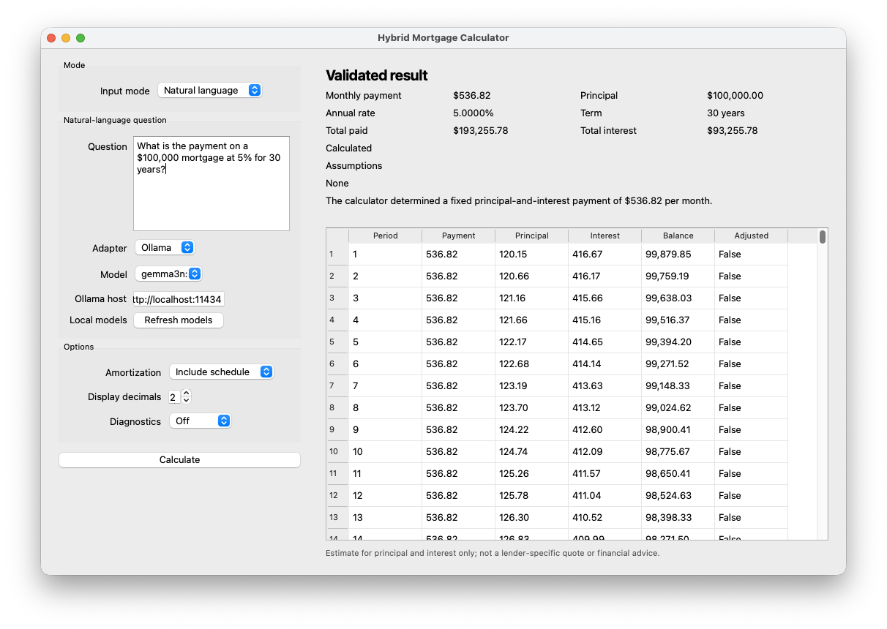

# Chapter 31 — Hybrid Mortgage Calculator

A deterministic fixed-rate mortgage calculator with a natural-language interface. The application demonstrates a strict hybrid boundary:

```text
User language
     |
     v
LLM adapter: interpret and explain
     |
     v
Calculator tool: validate and calculate
     |
     v
Deterministic financial result
```

The model is never the authority for mortgage arithmetic. It extracts structured inputs and explains the result returned by the calculator; the calculation core owns formulas, validation, precision, and failure semantics.

## Learning objectives

Chapter 31 demonstrates how to:

- Separate probabilistic language behavior from deterministic financial computation.
- Implement four inverse fixed-rate mortgage calculations.
- Normalize annual percentages and years into monthly canonical units.
- Validate financial invariants before calculation.
- Use a bounded bisection solver for interest-rate inversion.
- Generate an amortization schedule without premature rounding.
- Expose deterministic behavior through a structured tool contract.
- Use an offline mock adapter for reproducible tests.
- Connect an optional local Ollama model without giving it numerical authority.
- Test both traditional software behavior and natural-language interpretation.

## Scope

The MVP supports:

- Fixed-rate mortgages.
- Monthly payment periods.
- Principal (`P`), monthly periodic rate (`r`), payment count (`n`), and monthly payment (`M`).
- Calculation of exactly one missing primary quantity from the other three.
- Optional amortization schedules of at most 1,200 payment periods.
- Direct structured CLI requests.
- Natural-language requests through the mock adapter or local Ollama.

The MVP does **not** model adjustable-rate or interest-only loans, balloon payments, negative amortization, refinancing, closing costs, mortgage insurance, property taxes, homeowners insurance, HOA fees, lender-specific fees, tax deductions, lender quotes, or personalized financial advice.

## Setup

Python 3.12 and `uv` are required.

```bash
cd labs/week4/chapter31
uv sync --extra test --extra gui
```

The test environment is self-contained. Tests do not require:

- An API key.
- A running Ollama daemon.
- Network access.
- A visible GUI display; GUI tests use `QT_QPA_PLATFORM=offscreen`.

## Quick start

Calculate a monthly payment from a principal, annual interest rate, and term:

```bash
uv run mortgage calculate \
  --principal 500000 \
  --rate 6.5 \
  --term-years 30
```

Expected text output includes the payment, total paid, total interest, and the scope disclaimer:

```text
Principal: $500,000.00
Periodic rate: 0.005416666666666666666666666667
Annual rate: 6.5000%
Payments: 360
Payment: $3,160.34
...
Estimate for principal and interest only; not a lender-specific quote or financial advice.
```

Run the offline natural-language path:

```bash
uv run mortgage ask --adapter mock \
  'What is the payment on $500,000 at 6.5% for 30 years?'
```

Run the test suite:

```bash
uv run pytest -q
```

## Direct calculation mode

The `calculate` command accepts exactly three primary quantities:

| Input | Meaning | Direct CLI representation |
| ----- | ------- | ------------------------- |
| `--principal` | Loan principal `P` | Currency amount, e.g. `500000` |
| `--rate` | Interest rate `r` | Annual percentage by default, e.g. `6.5`; monthly decimal with `--rate-period monthly` |
| `--payments` | Number of monthly payments `n` | Positive integer, e.g. `360` |
| `--term-years` | Alias for monthly payment count | Positive term whose value times 12 is an integer, e.g. `30` |
| `--payment` | Fixed monthly payment `M` | Currency amount, e.g. `3000` |

The missing quantity is calculated automatically. `--payments` and `--term-years` are mutually exclusive. Conflicting aliases are usage errors rather than precedence decisions.

Examples:

```bash
# Calculate payment
uv run mortgage calculate --principal 500000 --rate 6.5 --term-years 30

# Calculate principal
uv run mortgage calculate --payment 3000 --rate 6 --term-years 30

# Calculate number of payments
uv run mortgage calculate --principal 500000 --rate 6 --payment 3000

# Calculate monthly rate, then derive annual rate
uv run mortgage calculate --principal 500000 --payment 3160.34 --payments 360

# Supply a monthly decimal rate instead of an annual percentage
uv run mortgage calculate --principal 500000 --rate 0.005 --rate-period monthly --term-years 30
```

### JSON output

Use `--format json` for automation. Add `--verbose` before or after the subcommand for levelled diagnostics:

- No flag: quiet.
- `--verbose` or `--verbose INFO`: colored metadata only, including mode, adapter, model, phase, normalized inputs, payload sizes, and tool status.
- `--verbose DEBUG`: INFO metadata plus raw model prompts and responses.

CLI diagnostics are written to `stderr`; normal result output stays on `stdout` and is unchanged.

```bash
uv run mortgage --verbose calculate --principal 500000 --rate 6.5 --term-years 30
uv run mortgage --verbose DEBUG ask --adapter real --model llama3.2 'What is the payment on $500,000 at 6.5% for 30 years?'
uv run mortgage calculate --verbose INFO --principal 500000 --rate 6.5 --term-years 30
```

Use `--format json` for automation:

```bash
uv run mortgage calculate \
  --principal 500000 \
  --rate 6.5 \
  --term-years 30 \
  --format json
```

The JSON response is a discriminated envelope:

```json
{
  "ok": true,
  "result": {
    "principal": "500000",
    "periodic_rate": "0.005416666666666666666666666667",
    "payments": 360,
    "payment": "3160.3401174648186602291583813248289656596159672960",
    "annual_rate": "0.06500000000000000000000000000",
    "term_years": "30",
    "total_paid": "1137722.442287334717682497017",
    "total_interest": "637722.442287334717682497017",
    "missing_quantity": "payment",
    "schedule": null
  },
  "error": null,
  "metadata": {
    "schema_version": "0.2",
    "adapter": "direct",
    "assumptions": [],
    "calculation_config": {
      "solver_tolerance": "1E-12",
      "solver_max_iterations": "100"
    }
  },
  "disclaimer": "Estimate for principal and interest only; not a lender-specific quote or financial advice."
}
```

Decimal values are serialized as strings so consumers do not lose precision. Integer counts remain JSON integers. Non-finite values are rejected.

## Desktop UI

Launch the PyQt5 desktop application with:

```bash
uv run mortgage-gui
```



*Example GUI run using Ollama natural-language mode with an included amortization schedule.*

The window has two modes:

- **Calculator:** enter principal, rate, term/payments, and optionally a payment; the UI calculates the missing quantity through the deterministic service.
- **Natural language:** enter a mortgage question and choose `Mock` for the offline adapter or `Ollama` for a local model. Selecting Ollama queries `/api/tags` in a background worker and fills the model dropdown; use **Refresh models** to query again. Ollama requests run in a worker thread so the UI remains responsive.

The result panel displays payment, principal, annual rate, term, total paid, total interest, assumptions, status/error text, the optional amortization table, and the principal-and-interest disclaimer. The selected amortization option applies to both calculator and natural-language results, including rate-solving requests. Invalid inputs and missing natural-language parameters are rendered as status messages rather than guessed results. Use the **Verbosity** selector (`Off`, `INFO`, `DEBUG`) in the Options panel: `INFO` shows metadata and `DEBUG` additionally shows raw model prompts/responses.

Run the offscreen UI tests with:

```bash
QT_QPA_PLATFORM=offscreen uv run pytest tests/test_ui.py -q
```

## Amortization schedules

Generate a schedule by using the `amortize` command:

```bash
uv run mortgage amortize \
  --principal 500000 \
  --rate 6.5 \
  --term-years 30 \
  --format json
```

Each row contains:

- `period`
- `payment`
- `principal`
- `interest`
- `balance`
- `adjusted_payoff`

The schedule uses full internal precision. If the ordinary recurrence leaves a residual balance, the final row is an adjusted payoff row whose payment equals principal plus interest and whose balance is zero. Schedule generation is bounded at 1,200 payment periods.

## Natural-language interface

### Offline mock adapter

The mock adapter is the default and is used by the automated suite:

```bash
uv run mortgage ask --adapter mock \
  'I can pay $3,000 a month at 6% for 30 years. How much can I borrow?'
```

It supports deterministic examples for:

- Payment calculation.
- Principal calculation.
- Payment-count calculation.
- Rate calculation.
- Clarification when rate or term is missing.
- Unsupported taxes, insurance, HOA, or lender requests.
- Derived principal from purchase price and down payment.
- Payment-too-low validation.

### Local Ollama adapter

Install and start Ollama separately, then pull a model:

```bash
ollama pull llama3.2
```

Run the real adapter:

```bash
uv run mortgage ask \
  --adapter real \
  --model llama3.2 \
  'What is the payment on $500,000 at 6.5% for 30 years?'
```

Defaults and overrides:

| Setting | Default | Override |
| ------- | ------- | -------- |
| Ollama host | `http://localhost:11434` | `--host` or `OLLAMA_HOST` |
| Ollama model | `llama3.2` | `--model` or `OLLAMA_MODEL` |
| Request timeout | 30 seconds | configured by the adapter API |

The Ollama adapter makes two non-streaming `/api/chat` requests:

1. Request a JSON-only structured interpretation with normalized monthly fields.
2. Send the calculator result to the model for a natural-language explanation.

The adapter calls the calculator tool between those phases. In the GUI, selecting Ollama calls `GET /api/tags` in a background worker, deduplicates and sorts the returned model names, and fills the model dropdown. **Refresh models** repeats the query; a discovery failure leaves a safe default or displays `No local models found` with an error status. The adapter accepts one optional JSON code fence and normalizes local-model `U+2581` space markers before parsing. It also maps common aliases such as `loan_amount`, `interest_rate`, and `loan_term` to canonical fields, then infers the missing field from the user’s intent before calling the tool. A timeout, connection failure, malformed model response, or missing `message.content` returns `MODEL_ERROR` with exit code `5`. It never substitutes model-generated arithmetic.

When entering prompts in a shell, use single quotes or escape dollar signs so the shell does not expand currency amounts:

```bash
uv run mortgage ask --adapter real --model gemma3n:e4b \
  'What is the payment on a 5% a year $100,000 30-year loan?'
```

Do not use unescaped `$100,000` inside double quotes.

## Architecture and module map

```text
+-------------------------+
| cli.py                  |
| argparse + exit mapping |
+------------+------------+
             |
             v
+-------------------------+       +----------------------+
| service.py / tool.py   |<------| llm.py               |
| typed response envelope|       | mock or Ollama       |
+------------+------------+       +----------+-----------+
             |                               |
             v                               v
+---------------------------------------------------------+
| Deterministic core                                     |
| models.py -> validation.py -> calculator.py             |
|                              -> amortization.py         |
| presentation.py formats only at the boundary            |
+---------------------------------------------------------+
```

| Module | Responsibility |
| ------ | -------------- |
| `models.py` | Frozen request, result, error, schedule, interpretation, evidence, and metadata types. |
| `validation.py` | Quantity-count, domain, finite-number, integer-term, and schedule-bound validation. |
| `calculator.py` | Four inverse calculations, zero-rate paths, and bounded bisection rate solving. |
| `amortization.py` | O(n) full-precision payment schedule generation. |
| `tool.py` | Structured calculator-tool input parsing and Decimal-safe output serialization. |
| `service.py` | Public result envelope and conversion of internal failures to typed errors. |
| `llm.py` | Offline mock adapter, Ollama HTTP client, and Ollama adapter boundary. |
| `presentation.py` | Text/JSON presentation and disclaimer handling. |
| `cli.py` | Commands, normalization of CLI aliases, adapter selection, and exit codes. |

## Financial model

For a positive monthly rate, payment is:

```text
M = P * r * (1 + r)^n / ((1 + r)^n - 1)
```

The inverse relationships are:

```text
P = M * ((1 + r)^n - 1) / (r * (1 + r)^n)

n = ln(M / (M - P*r)) / ln(1 + r)

M = P * r * (1 + r)^n / ((1 + r)^n - 1)  [solve for r by bisection]
```

At zero rate, the implementation uses:

```text
M = P / n
P = M * n
n = P / M, only when the quotient is within 1e-9 of an integer
```

The rate solver uses the deterministic interval `[0, 1]`, residual/interval tolerance `1e-12`, and at most 100 iterations. A payment that does not cover first-period interest is rejected when solving for the term.

## Validation and failure behavior

The public service and tool return an envelope with either `ok: true` and a result or `ok: false` and a structured error. Typical errors include:

| Code | Meaning |
| ---- | ------- |
| `INVALID_QUANTITY_COUNT` | Not exactly one primary quantity is missing. |
| `INVALID_PRINCIPAL` | Principal is zero, negative, or non-finite. |
| `INVALID_RATE` | Rate is negative or non-finite. |
| `INVALID_PAYMENTS` | Payment count is invalid, out of bounds, or a non-integral inverse term. |
| `INVALID_PAYMENT` | Payment is zero, negative, or non-finite. |
| `PAYMENT_TOO_LOW` | Payment does not exceed first-period interest. |
| `SOLVER_CONVERGENCE` | Rate solver cannot bracket or converge on a solution. |
| `CLARIFICATION_REQUIRED` | Natural-language input lacks required or unambiguous values. |
| `UNSUPPORTED_SCOPE` | Request asks for an excluded financial concept. |
| `TOOL_ERROR` | Structured tool input or serialization is invalid. |
| `MODEL_ERROR` | Optional real-model request fails or returns malformed output. |

CLI exit codes are stable:

| Exit | Meaning |
| ---- | ------- |
| `0` | Successful calculation or clarification response. |
| `2` | Usage, normalization, validation, or clarification error. |
| `3` | Solver or calculator-tool failure. |
| `4` | Unsupported scope. |
| `5` | Real-model failure. |

## Testing

Run all tests with:

```bash
uv run pytest -q
```

The suite covers:

- Known-value payment calculation.
- Principal, payment-count, and rate inversion.
- Zero-interest behavior.
- Payment-too-low and non-integral-term failures.
- Bisection bracketing and convergence failures.
- Amortization row identity, final payoff, and 1,200-row bound.
- Decimal-string JSON and structured error envelopes.
- Mock natural-language extraction, clarification, scope handling, and evidence.
- Ollama interpretation/explanation sequencing using an offline fake transport.
- CLI output, levelled Loguru diagnostics, and exit-code behavior.
- GUI verbosity selector and diagnostic status behavior.
- Property-based payment/principal and payment/rate round trips over 100 generated cases.

The Ollama adapter tests do not open a socket. To manually exercise the real path, use a locally running Ollama daemon and an installed model.

## Evaluation mode

Run the bundled natural-language evaluation dataset through the deterministic offline mock adapter:

```bash
uv run mortgage eval \
  --dataset evals/mortgage_questions.jsonl \
  --adapter mock \
  --out eval_report.json
```

The command prints a summary and, when cases fail, prints each failed case with its question, failure classification, failure reasons, expected values, actual values, and check results. It also writes a versioned report containing the same per-case expected/actual details plus intent and field accuracy, numeric-result accuracy, clarification accuracy, and scope accuracy. It never uses an LLM judge for financial correctness.

The bundled dataset covers payment, principal, term/payment-too-low, rate, clarification, and unsupported-scope cases. A successful baseline currently reports:

```text
Evaluation: 6/6 cases passed
```

For a real-model evaluation, make the dependency explicit and label the report with the selected model:

```bash
uv run mortgage eval \
  --dataset evals/mortgage_questions.jsonl \
  --adapter real \
  --model llama3.2 \
  --out eval_report.json \
  --verbose INFO
```

Real-model failures are recorded per case and return exit code `5`; case mismatches, invalid model requests, or tool errors return exit code `1`; malformed datasets return exit code `2`. The report distinguishes `model_error`, `tool_error`, and `invalid_request` outcomes.

## Development workflow

```bash
cd labs/week4/chapter31
uv sync --extra test --extra gui
uv run pytest -q
uv run mortgage calculate --principal 500000 --rate 6.5 --term-years 30
uv run mortgage ask --adapter mock 'What is the payment on $500,000 at 6.5% for 30 years?'
```

Keep the deterministic core independent of the model provider. When changing formulas, validation, serialization, or adapter behavior, update the corresponding tests and the authoritative specification at `SPEC.md`.

## Safety and scope disclaimer

This project is an educational MVP. Results are estimates for principal and interest only. They are not lender-specific quotes, underwriting decisions, or financial advice. Taxes, insurance, HOA fees, lender fees, and other housing costs are intentionally outside the calculation model.
