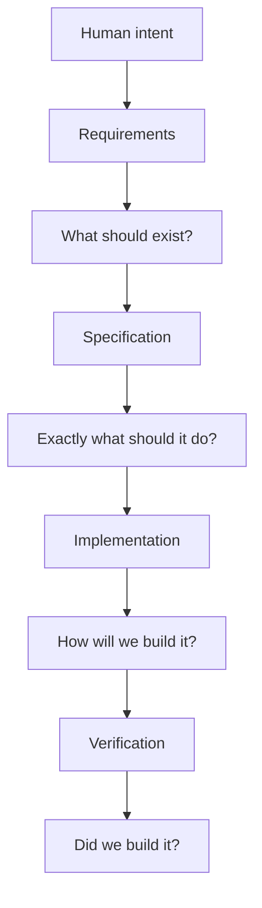
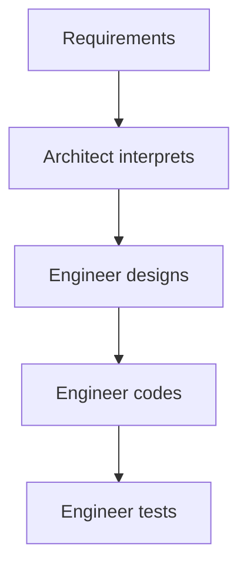
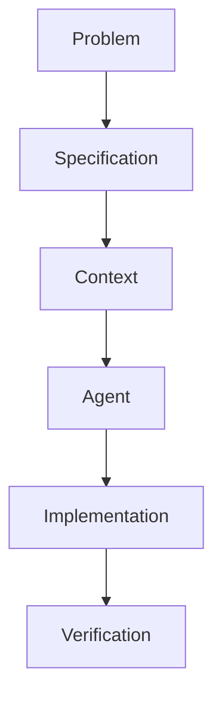
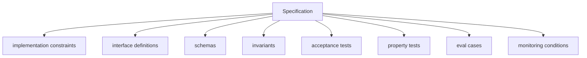
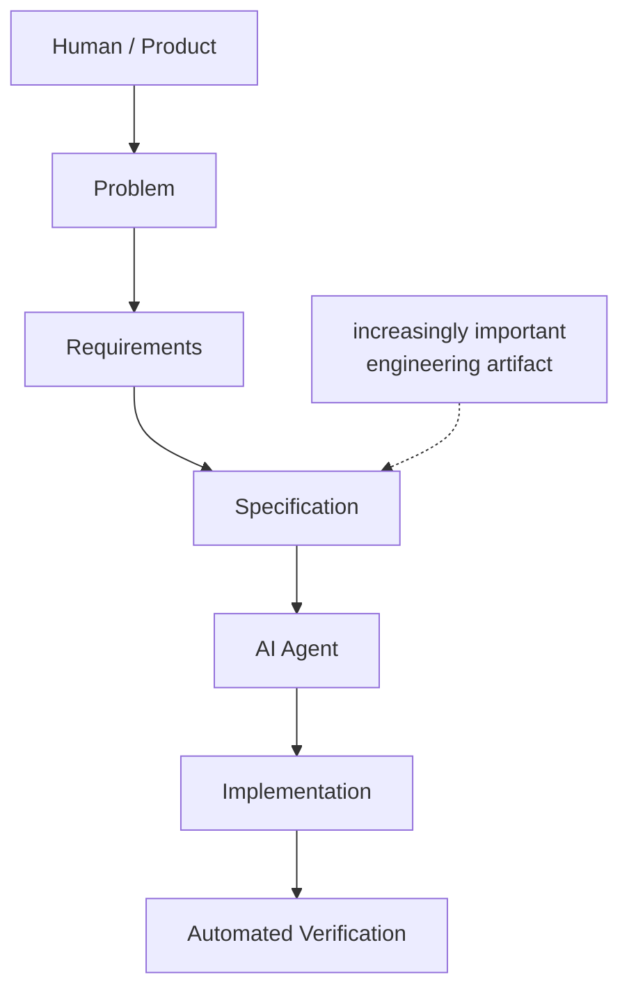

# How requirements differ from specification?

The distinction is straightforward to state and consequential in practice: **traditional requirements describe what the system should do**, while a modern **specification describes the system precisely enough that an AI agent can actually construct, test, and verify it**. This chapter opens a short sequence on specification as an engineering discipline; the chapters that follow examine the discipline itself and the toolchain that supports it.

This distinction is central to the 2026 development model the sequence builds toward:

> **Problem → Specification → Context → Agent(s) → Generated implementation → Automated verification**

## Traditional Requirements

A traditional requirement is primarily a **statement of desired behavior or business need**.

For example:

> "Users should be able to upload a PDF and ask questions about it."

Or, more formally:

> "The system shall allow authenticated users to upload PDF documents up to 50 MB."

Requirements typically answer:

* **What** capability is needed?
* **Why** is it needed?
* **Who** needs it?
* What are the major constraints?

They intentionally leave substantial implementation freedom to engineers.

A requirements document might contain:

```text
REQ-17:
The system shall allow users to search uploaded documents.

REQ-18:
Search results shall be relevant to the user's query.

REQ-19:
The system shall respond within 3 seconds under normal load.
```

These are useful, but an AI coding agent still has to infer a great deal. The question, then, is what closes that inference gap.

## The Specification as an Operational Contract

A specification takes the requirement and turns it into something closer to an **executable engineering contract**. Consider the same capability stated both ways.

### Requirement

> Users should be able to search their uploaded documents.

### Specification

```text
Document Search

Input:
  query: string, 1–500 characters
  user_id: authenticated UUID
  filters:
    document_ids: optional list[UUID]
    date_range: optional

Processing:
  1. Normalize query.
  2. Generate embedding using model X.
  3. Perform hybrid BM25 + vector retrieval.
  4. Retrieve top 50 candidates.
  5. Rerank candidates using model Y.
  6. Return top 8 passages.

Output:
  {
    results: [
      {
        document_id: UUID,
        chunk_id: UUID,
        text: string,
        score: float,
        citation: Citation
      } ]
  }

Constraints:
  - p95 latency < 800 ms
  - no results from documents the user cannot access
  - deterministic filtering
  - scores must be normalized to [0,1]

Failure behavior:
  - malformed query → 400
  - unauthorized document → excluded
  - retrieval service unavailable → 503
  - zero matches → empty result set

Tests:
  - authorization isolation
  - exact-match retrieval
  - semantic retrieval
  - empty query
  - 50 MB document
  - retrieval timeout
  - latency p95
```

An agent working from this specification has substantially less to guess. The remaining question is what, structurally, changed between the two versions.

## The Deepest Difference: Requirements Express Intent; Specifications Reduce Ambiguity

The relationship can be summarized as follows:



Traditional engineering treats requirements as the beginning of a **human interpretation process**. AI-native engineering must make that interpretation far more explicit — which raises the question of exactly which dimensions of behavior a specification needs to pin down.

## What Specifications Make Explicit

A useful specification generally makes several dimensions explicit:

| Dimension           | Requirement         | Specification             |
| ------------------- | ------------------- | ------------------------- |
| Intent              | Yes                   | Yes                         |
| Functional behavior | Yes                   | Yes                         |
| Interfaces          | Sometimes           | Explicit                  |
| Data structures     | Sometimes           | Explicit                  |
| Preconditions       | Rarely              | Explicit                  |
| Postconditions      | Sometimes           | Explicit                  |
| Error behavior      | Often vague         | Explicit                  |
| Edge cases          | Limited             | Explicit                  |
| Constraints         | High-level          | Precise                   |
| Security properties | General             | Testable                  |
| Performance         | Targets             | Measurable conditions     |
| State transitions   | Rarely              | Explicit                  |
| Dependencies        | General             | Explicit                  |
| Acceptance criteria | Yes                   | Executable/testable       |
| Tests               | Separate artifact   | Often derived directly    |
| Implementation      | Usually unspecified | Still can remain abstract |

Notably, **a specification does not necessarily prescribe implementation**. It can state:

> "The operation must be idempotent."

without stating:

> "Use PostgreSQL advisory locks."

That distinction matters: a specification constrains behavior without foreclosing implementation choices. It follows that the value of a specification comes from precision, not from sheer volume of text — a point worth making explicit, since the two are easy to conflate.

## Precision, Not Verbosity

The goal is not to turn every requirement document into a 500-page implementation document.

The difference is **precision and formalizability**, not merely length.

Consider:

> "The application should be fast."

Adding more words does not make this a better specification.

Instead:

> "For requests containing <=10,000 records, p95 end-to-end latency must be <500 ms at 100 requests/sec."

This is now a **verifiable property**.

Likewise:

> "The system should handle errors gracefully."

becomes:

```text
If the downstream payment service returns 429:
  retry with exponential backoff
  maximum attempts = 3
  maximum elapsed retry time = 5 seconds
  return PAYMENT_PROVIDER_UNAVAILABLE if all attempts fail
  do not create a duplicate order
```

The second version is useful to both a human engineer **and an AI agent** — and that dual usefulness is the real payoff of the extra precision, not the precision for its own sake.

## Specifications as Agent Context

This dual usefulness is what makes the distinction central to the AI engineer's changing role.

In traditional development:



There are several layers of implicit human reasoning.

In AI-assisted development:



The specification becomes a major part of the **context supplied to the agent**. The better the specification, the smaller the agent's inference space, which can be expressed approximately as:

$$
\text{Implementation quality}
\approx
f(\text{model capability},\text{context quality},\text{specification precision},\text{verification})
$$

A vague requirement forces the agent to make architectural and behavioral assumptions. A precise specification constrains those assumptions — and, taken further, constrains them in a way that can itself be checked mechanically.

## Specifications as Machine-Checkable Artifacts

This may be the most consequential difference of all.

Traditional requirements are ultimately evaluated by asking:

> "Does this satisfy the customer's requirement?"

Specifications can increasingly be transformed into:



The specification becomes a **source from which engineering artifacts can be generated** — API schemas, database schemas, test cases, agent instructions, eval datasets, observability requirements, and acceptance criteria all follow from the same document. That is considerably more powerful than a conventional requirements document, and it changes who the specification is written for.

## From Human-Facing to Dual-Facing

A traditional requirement might state:

> "Administrators should be able to disable a user."

A specification defines:

```text
Operation: DisableUser

Authorization:
  caller.role == ADMIN

Precondition:
  target.status != DELETED

State transition:
  ACTIVE → DISABLED
  SUSPENDED → DISABLED

Forbidden transitions:
  DELETED → DISABLED

Side effects:
  invalidate active sessions
  revoke API tokens

Audit:
  emit UserDisabled event

Idempotency:
  disabling an already-disabled user succeeds
  and produces no second state transition

Verification:
  unauthorized caller → 403
  disabled user → sessions invalidated
  repeated request → same final state
```

This sits almost halfway between documentation and executable semantics — precisely the direction AI-native software engineering is moving. Pulling these threads together yields a working definition of the distinction itself.

## A Working Definition

The clearest formulation is this:

> **Requirements express desired outcomes. Specifications define the observable behavior, constraints, interfaces, invariants, and acceptance conditions that make those outcomes unambiguous and verifiable.**

Or, more compactly:

> **Requirements describe intent. Specifications operationalize intent.**

And in the AI-engineering context:

> **The traditional engineer interprets requirements; the AI agent executes against specifications.**

This does not mean humans stop defining requirements. Rather, a new intermediate engineering activity emerges:



That intermediate activity — turning requirements into precise, testable specifications — is substantial enough to be its own discipline. The next chapter, on Specification Engineering, describes what that discipline actually involves.
