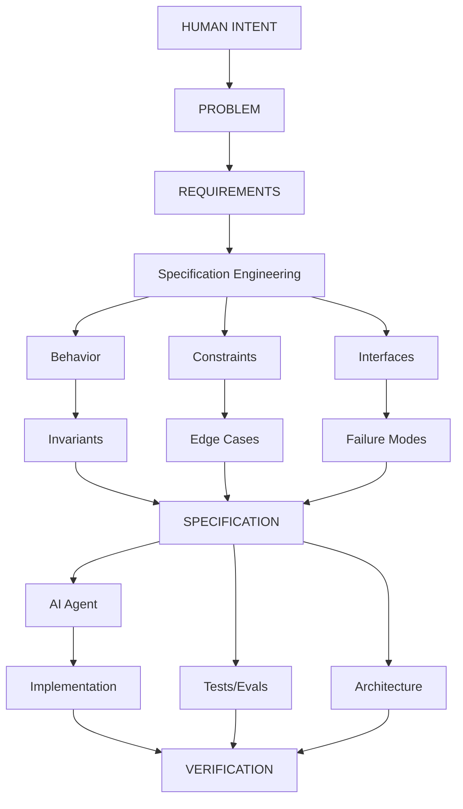
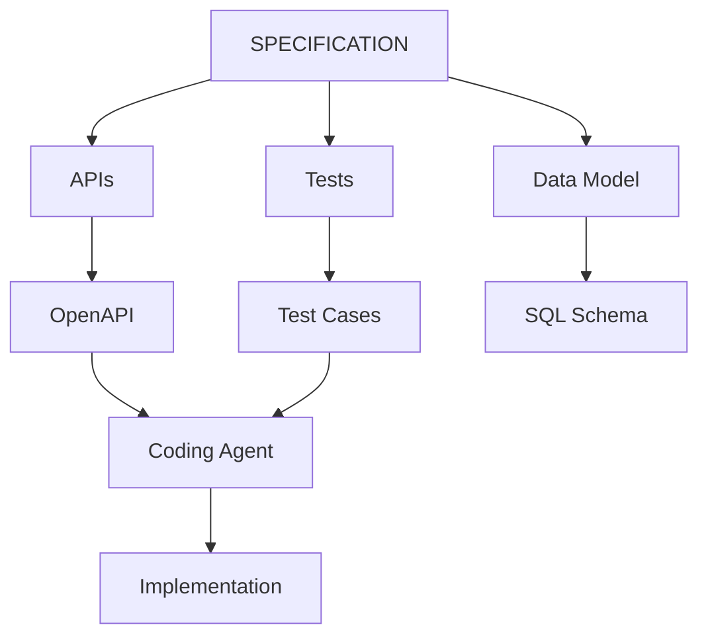
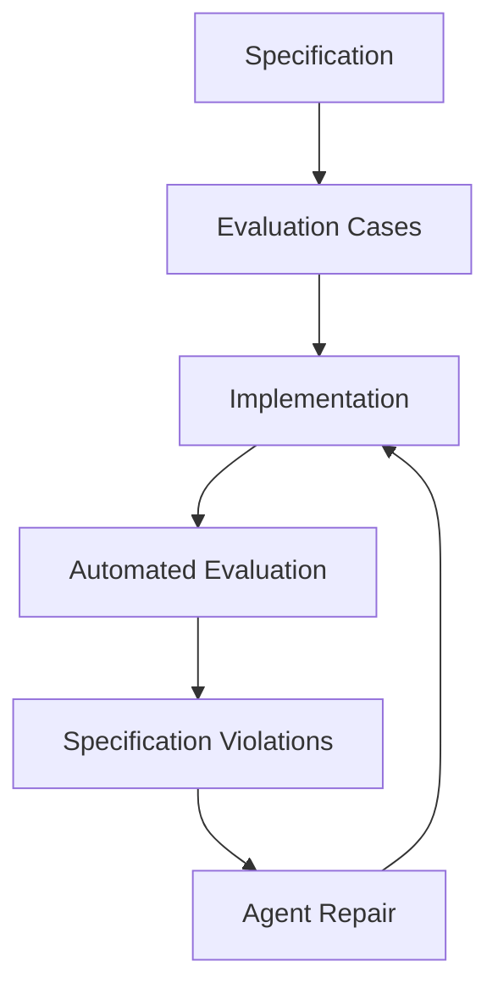
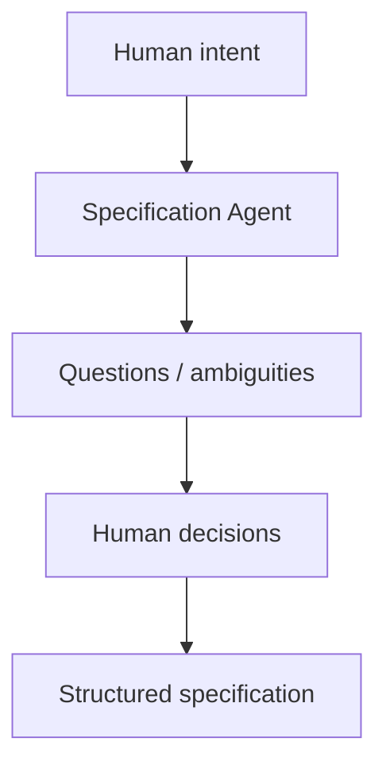
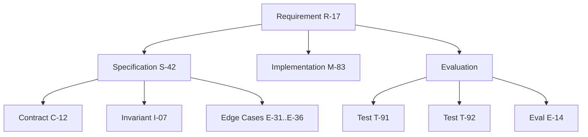
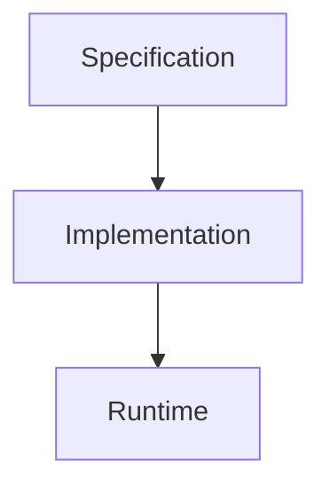
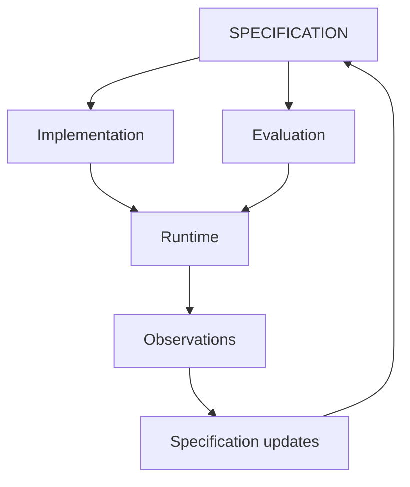
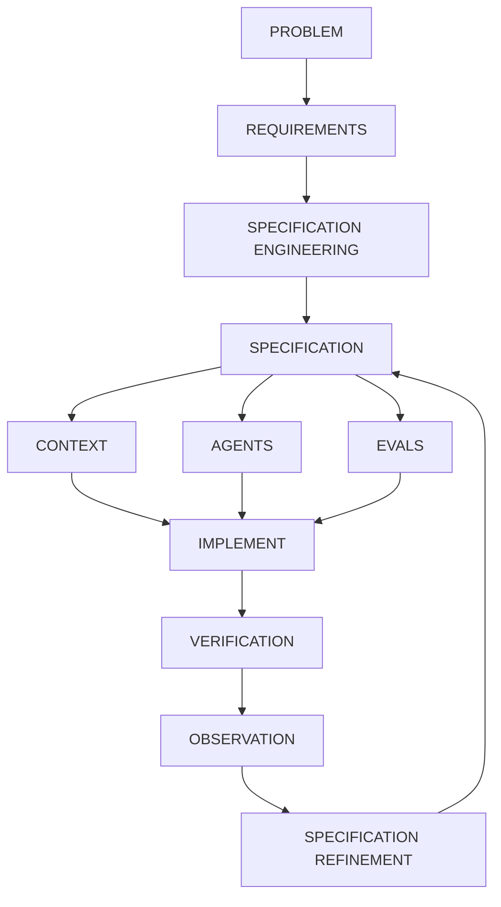

# Specification Engineering

Specification Engineering is best treated as a distinct engineering discipline sitting between product intent and implementation. The preceding chapter distinguished specifications from requirements; this chapter examines the discipline that produces them.

The core idea is:

> **Specification Engineering is the systematic transformation of ambiguous human intent into precise, machine-consumable, testable, and maintainable specifications from which implementation and verification can be derived.**

In traditional software engineering, this activity is distributed across product managers, architects, designers, and engineers. In an AI-native environment, it becomes far more explicit, because **the specification is one of the primary inputs to the coding agent**.

## The Specification Engineering Pipeline

The pipeline can be represented as follows:



The important change is that **the specification becomes a central engineering artifact rather than merely documentation**. What that pipeline compresses into a single diagram is, in practice, a set of distinct activities — worth unpacking one at a time.

## What a Specification Engineer Actually Does

The discipline breaks down into roughly eight activities, beginning with the least structured: turning an unstructured request into something that can be modeled at all.

### Intent Elicitation

The starting point is typically something unstructured:

> "We need a research assistant that can answer questions over our internal documents."

The Specification Engineer extracts:

* actors
* goals
* workflows
* assumptions
* constraints
* business rules
* security requirements
* quality attributes
* unacceptable behaviors

This work is partly product analysis and partly systems engineering. Once these elements are identified, the next task is to turn them into something with observable structure rather than prose.

### Behavioral Modeling

Prose is turned into observable behavior. A document-ingestion workflow, for instance, moves through a fixed sequence: the user uploads a document, the system validates it, the document enters a processing state, text is extracted, chunks are generated, embeddings are computed, the index is updated, and only then does the document become searchable.

From a sequence like this, the engineer defines states, transitions, events, preconditions, postconditions, and failure transitions — essentially **formal state-machine thinking applied pragmatically**. Once behavior is modeled this way, the natural next step is to define what components promise each other at each boundary.

### Contract Definition

Contracts define what components promise to each other.

For example:

```text
POST /documents

Input:
  file: PDF
  max_size: 50 MB

Output:
  document_id: UUID
  status: PROCESSING

Guarantees:
  document_id is globally unique
  caller can access only their own document

Errors:
  400 malformed file
  413 file too large
  401 unauthenticated
```

The contract is useful simultaneously to the coding agent, the API designer, the test generator, the reviewer, and the monitoring system. Contracts describe individual promises; a complete specification also needs properties that hold everywhere at once — invariants.

## Invariants

An **invariant** states something that must *always* remain true.

For example:

```text
INV-001:
A user must never retrieve a document belonging to another user.

INV-002:
A deleted document must never appear in search results.

INV-003:
Every completed payment has exactly one corresponding order.

INV-004:
A retry of an idempotent operation must not create duplicate side effects.
```

These are extraordinarily valuable for AI agents because they constrain the solution space. The agent can generate many implementations, but every implementation must satisfy the invariant. Invariants describe what must hold; a specification also needs to describe what happens when things go wrong — a dimension conventional requirements handle poorly.

## Failure Semantics

Traditional requirements tend to emphasize the happy path. AI-generated systems need much stronger failure specifications.

Instead of:

> "The system retrieves documents."

the specification should read:

```text
Retrieval failure:

If vector search times out:
    retry once

If retry fails:
    fall back to lexical search

If lexical search fails:
    return RETRIEVAL_UNAVAILABLE

Never:
    fabricate search results
    return results from unauthorized documents
```

This matters particularly because an LLM-based system exhibits **probabilistic failure modes** that do not exist in conventional deterministic software — which raises a category of specification that has no real analogue in pre-AI systems.

## AI-Specific Behavioral Contracts

This is where the discipline becomes genuinely new. A specification for an AI system may need to describe model behavior, grounding, uncertainty, tool usage, agent permissions, and stopping conditions.

### Model behavior

```text
The model must answer only from supplied evidence.
```

### Grounding

```text
Every factual claim must be attributable to one or more retrieved passages.
```

### Uncertainty

```text
If evidence confidence < threshold:
    do not provide a definitive answer.
```

### Tool usage

```text
The financial database must be queried before answering
questions involving current account balances.
```

### Agent permissions

```text
The agent may:
    read documents
    search database

The agent may not:
    delete documents
    execute arbitrary SQL
    modify financial records
```

### Stopping conditions

```text
The agent must terminate when:
    answer confidence >= threshold
    OR
    maximum iterations = 8
    OR
    no additional information can be obtained.
```

This is essentially **behavioral specification for probabilistic components**. Once behavior, contracts, invariants, and failure modes are all captured this way, the specification stops being merely descriptive — it becomes something other artifacts can be derived from.

## Specifications as Generative Sources

A good specification does not merely tell an engineer what to build. It allows an AI system to derive engineering artifacts directly.



And further:



This resembles a **specification → synthesis → verification loop**. How far a specification can drive that loop depends on how formally it is written — which is a matter of degree, not a binary property.

## Three Levels of Formality

### Level 1 — Prose specification

```text
The system should respond quickly.
```

This level carries intent but resists verification.

### Level 2 — Structured specification

```text
p95 latency < 500 ms
under 100 requests/sec
for payloads <= 1 MB
```

This level is measurable, though it still requires a human or a separate test harness to check.

### Level 3 — Executable specification

```text
assert p95_latency(
    workload="standard",
    rps=100,
    payload_size <= 1MB
) < 500ms
```

At this level, the specification can directly participate in verification. The long-term trajectory moves from natural language, through structured specification and formal constraints, to executable tests and evals. Not every requirement needs to reach the executable level, but the important ones should — and reaching it consistently requires dedicated tooling, which is the subject of the next chapter.

## The Need for a Dedicated Toolchain

A mature Specification Engineering environment resembles an IDE. Instead of primarily editing source code, the engineer works with a structured view of the product:

```text
+---------------------------------------------------------+
| Product: Research Assistant                             |
+---------------------------------------------------------+
| REQUIREMENTS                                            |
|   R-001 Document ingestion                              |
|   R-002 Grounded answers                                |
|   R-003 Citation support                                |
|                                                         |
| BEHAVIOR                                                |
|   B-014 Search workflow                                 |
|   B-015 Answer workflow                                 |
|                                                         |
| INVARIANTS                                              |
|   I-001 Authorization isolation                         |
|   I-002 Citation grounding                              |
|                                                         |
| CONTRACTS                                               |
|   API-001 /documents                                    |
|   API-002 /search                                       |
|                                                         |
| EVALS                                                   |
|   E-001 Retrieval accuracy                               |
|   E-002 Groundedness                                     |
|   E-003 Hallucination                                    |
|                                                         |
| AGENTS                                                  |
|   research-agent                                         |
|   retrieval-agent                                        |
+---------------------------------------------------------+
```

The system continuously answers questions such as which requirements are implemented, which specifications have no tests, which tests fail, which agent changed behavior outside its specification, which specifications conflict, and — most importantly — which requirements remain underspecified. The next chapter treats this toolchain in depth; for now, it is enough to note that answering these questions well requires more than a document — it requires a specification that can be interrogated.

## AI as a Participant in Specification Engineering

The specification itself can become an interactive artifact.

Human:

> "Users should be able to share documents."

Agent:

> "With whom?"

Human:

> "Other users in the organization."

Agent:

> "Can external users receive access?"

Human:

> "No."

Agent:

> "Can the owner revoke access?"

Human:

> "Yes."

Agent:

> "Should revocation invalidate existing sessions?"

Human:

> "Yes."

The agent is effectively performing **specification elicitation**. It identifies ambiguity before implementation:



This represents a genuine shift in how the agent's role is framed:

> **The AI agent should not merely generate code from specifications. It should help discover and eliminate specification ambiguity before code is generated.**

Once ambiguity is resolved this way, the resulting specification needs to stay connected to everything downstream of it — which is the role traceability plays.

## Traceability

Traceability should be treated as a first-class property.



A change to R-17 then automatically identifies everything affected, producing something close to conventional requirements traceability, but far richer and far more automated. Once specifications are traceable in this way, they start to displace source code as the artifact developers actually treat as authoritative.

## Specification as the Stable Artifact

This is the most significant conceptual shift the discipline introduces.

Today:

```text
Source code
    ↓
system
```

Documentation describes the source code.

In an AI-heavy future:



The implementation becomes increasingly disposable. Agents can regenerate or substantially rewrite it. The specification, contracts, invariants, evaluations, and architectural constraints become the **persistent representation of engineering intent**, which implies a different lifecycle:



The system becomes a continuously evolving **specification–implementation–evaluation loop**. Taken together, the pipeline, the eight activities, and this lifecycle point toward a single working definition of the discipline.

## Defining Specification Engineering

The strongest formulation for this discipline is:

> **Specification Engineering is the discipline of transforming human intent into precise behavioral, structural, and operational contracts that can guide AI agents, constrain implementation, and generate automated verification.**

It has four objectives — removing ambiguity, constraining behavior, enabling generation, and enabling verification — which together make it fundamentally different from merely writing better requirements.

### The Resulting AI-Native Development Loop



As implementation becomes increasingly automated, the scarce engineering skill moves upward — from writing code toward precisely specifying what the code must mean and how correctness will be verified. The remainder of that skill is largely a question of tooling, which the next chapter addresses directly.
