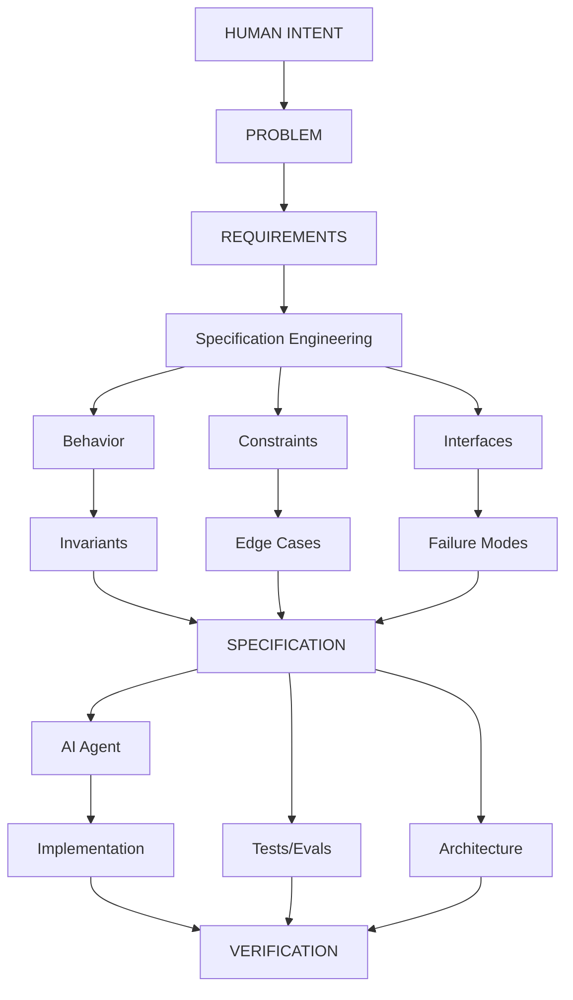
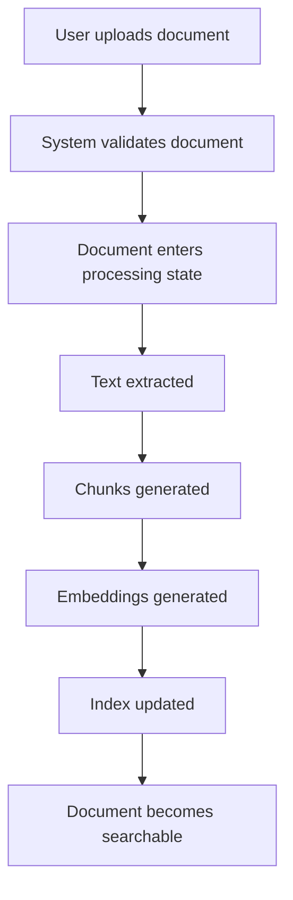
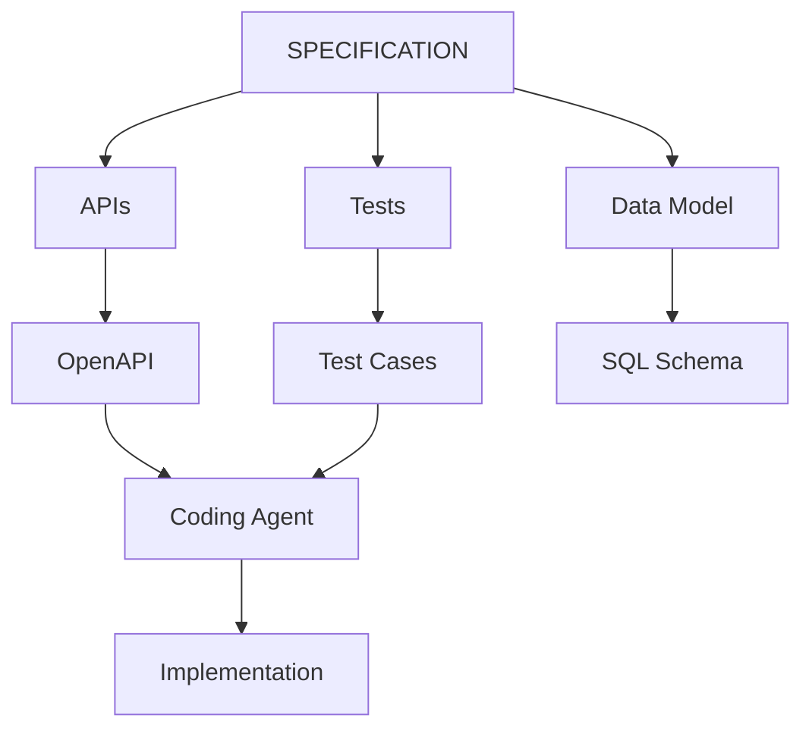
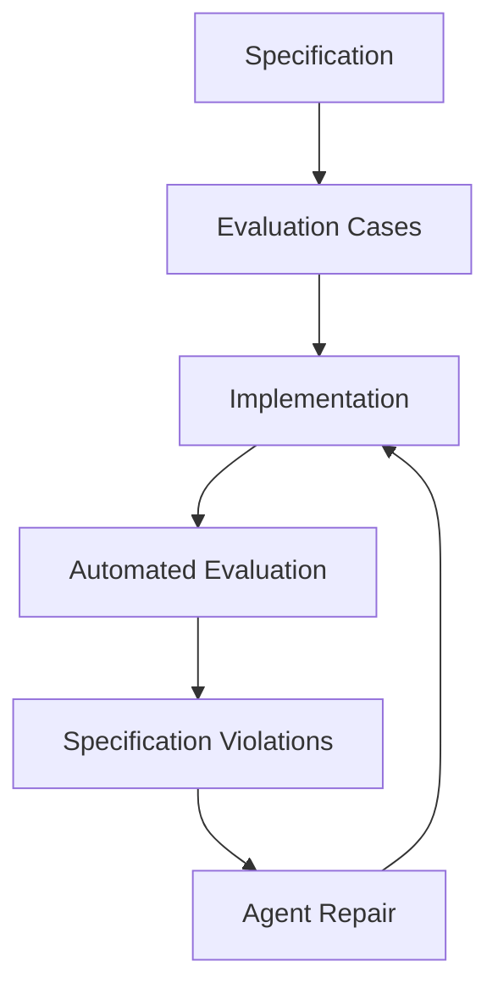
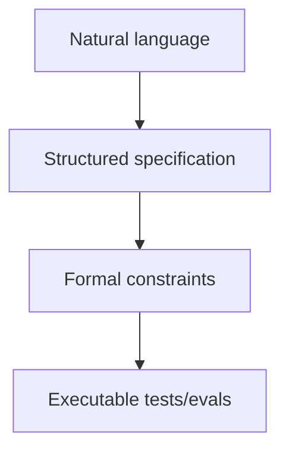
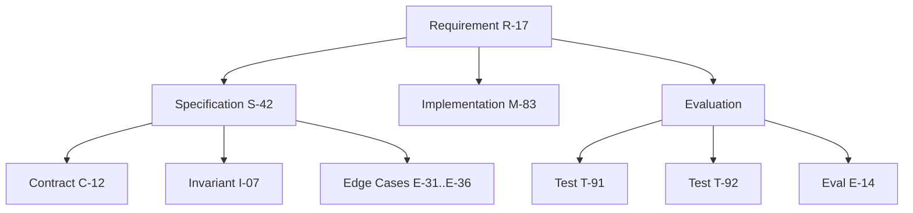
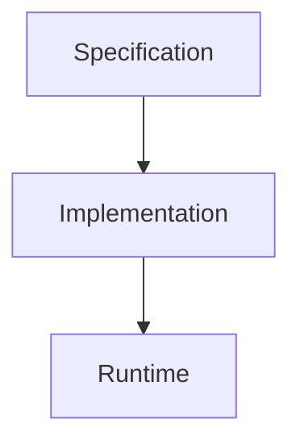
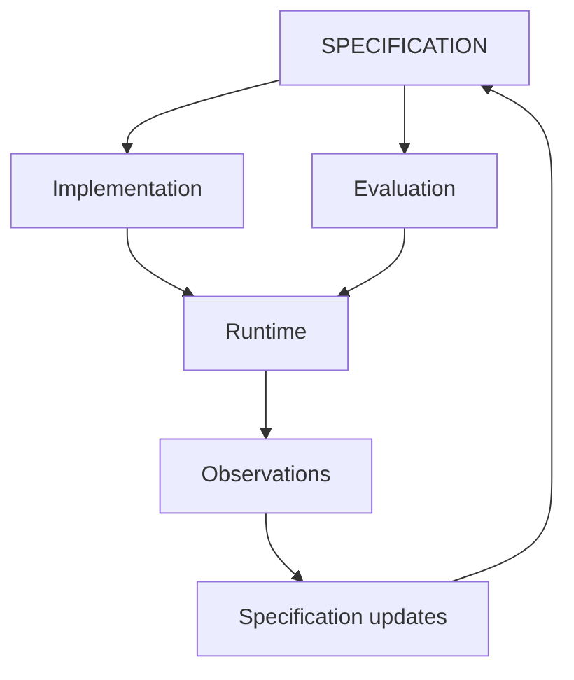
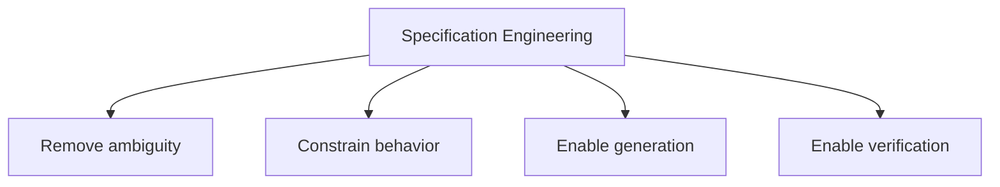
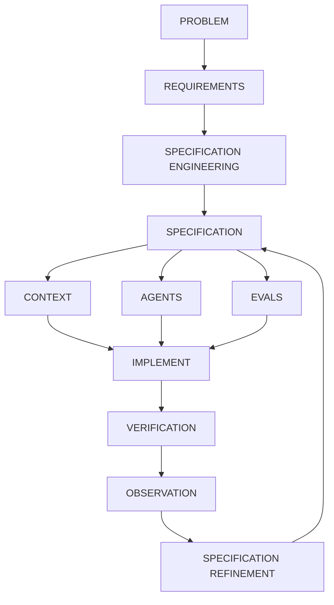

# Specification Engineering

I would treat **Specification Engineering** as a distinct engineering discipline sitting between product intent and implementation.

The core idea is:

> **Specification Engineering is the systematic transformation of ambiguous human intent into precise, machine-consumable, testable, and maintainable specifications from which implementation and verification can be derived.**

In traditional software engineering, this activity is distributed across product managers, architects, designers, and engineers. In an AI-native environment, it becomes much more explicit because **the specification is one of the primary inputs to the coding agent**.

## 1. The Specification Engineering pipeline

I envision something like:



The important change is that **the specification becomes a central engineering artifact rather than merely documentation**.

---

## 2. What does a Specification Engineer actually do?

I would break the discipline into roughly eight activities.

### 1. Intent elicitation

Start with something messy:

> "We need a research assistant that can answer questions over our internal documents."

The Specification Engineer extracts:

* actors
* goals
* workflows
* assumptions
* constraints
* business rules
* security requirements
* quality attributes
* unacceptable behaviors

This is partly product analysis and partly systems engineering.

---

### 2. Behavioral modeling

Turn prose into observable behavior.

For example:



Now you can define:

* states
* transitions
* events
* preconditions
* postconditions
* failure transitions

This is essentially **formal state-machine thinking applied pragmatically**.

---

### 3. Contract definition

Define what components promise to each other.

For example:

```text
POST /documents

Input:
  file: PDF
  max_size: 50 MB

Output:
  document_id: UUID
  status: PROCESSING

Guarantees:
  document_id is globally unique
  caller can access only their own document

Errors:
  400 malformed file
  413 file too large
  401 unauthenticated
```

The contract becomes useful simultaneously to:

* the coding agent
* the API designer
* the test generator
* the reviewer
* the monitoring system

---

## 3. The specification should contain invariants

This is one of the biggest differences from conventional requirements.

An **invariant** says something that must *always* remain true.

For example:

```text
INV-001:
A user must never retrieve a document belonging to another user.

INV-002:
A deleted document must never appear in search results.

INV-003:
Every completed payment has exactly one corresponding order.

INV-004:
A retry of an idempotent operation must not create duplicate side effects.
```

These are extraordinarily valuable for AI agents because they constrain the solution space.

The agent can generate many implementations, but every implementation must satisfy the invariant.

---

## 4. Specifications should describe failure semantics

Traditional requirements tend to emphasize the happy path.

AI-generated systems need much stronger failure specifications.

Instead of:

> "The system retrieves documents."

specify:

```text
Retrieval failure:

If vector search times out:
    retry once

If retry fails:
    fall back to lexical search

If lexical search fails:
    return RETRIEVAL_UNAVAILABLE

Never:
    fabricate search results
    return results from unauthorized documents
```

This is particularly important because an LLM-based system has **probabilistic failure modes** that don't exist in conventional deterministic software.

---

## 5. Specification Engineering includes AI-specific behavioral contracts

This is where I think the discipline becomes genuinely new.

A specification for an AI system may need to describe:

### Model behavior

```text
The model must answer only from supplied evidence.
```

### Grounding

```text
Every factual claim must be attributable to one or more retrieved passages.
```

### Uncertainty

```text
If evidence confidence < threshold:
    do not provide a definitive answer.
```

### Tool usage

```text
The financial database must be queried before answering
questions involving current account balances.
```

### Agent permissions

```text
The agent may:
    read documents
    search database

The agent may not:
    delete documents
    execute arbitrary SQL
    modify financial records
```

### Stopping conditions

```text
The agent must terminate when:
    answer confidence >= threshold
    OR
    maximum iterations = 8
    OR
    no additional information can be obtained.
```

This is essentially **behavioral specification for probabilistic components**.

---

## 6. Specifications become generative

This is perhaps the most interesting consequence.

A good specification should not merely tell an engineer what to build.

It should allow an AI system to derive engineering artifacts.

For example:



And then:



That starts to resemble a **specification → synthesis → verification loop**.

---

## 7. This makes specifications closer to executable contracts

I would distinguish three levels:

### Level 1 — Prose specification

```text
The system should respond quickly.
```

Weak.

### Level 2 — Structured specification

```text
p95 latency < 500 ms
under 100 requests/sec
for payloads <= 1 MB
```

Much better.

### Level 3 — Executable specification

```text
assert p95_latency(
    workload="standard",
    rps=100,
    payload_size <= 1MB
) < 500ms
```

Now the specification can directly participate in verification.

The long-term trajectory is:



Not every requirement needs to reach Level 4. But the important ones should.

---

## 8. Specification Engineering needs its own toolchain

I would expect a future Specification Engineering environment to look something like an IDE.

Instead of primarily editing source code, you might have:

```text
+---------------------------------------------------------+
| Product: Research Assistant                             |
+---------------------------------------------------------+
| REQUIREMENTS                                            |
|   R-001 Document ingestion                              |
|   R-002 Grounded answers                                |
|   R-003 Citation support                                |
|                                                         |
| BEHAVIOR                                                |
|   B-014 Search workflow                                 |
|   B-015 Answer workflow                                 |
|                                                         |
| INVARIANTS                                              |
|   I-001 Authorization isolation                         |
|   I-002 Citation grounding                              |
|                                                         |
| CONTRACTS                                               |
|   API-001 /documents                                    |
|   API-002 /search                                       |
|                                                         |
| EVALS                                                   |
|   E-001 Retrieval accuracy                              |
|   E-002 Groundedness                                    |
|   E-003 Hallucination                                   |
|                                                         |
| AGENTS                                                  |
|   research-agent                                        |
|   retrieval-agent                                       |
+---------------------------------------------------------+
```

And the system could continuously answer:

> Which requirements are implemented?
>
> Which specifications have no tests?
>
> Which tests fail?
>
> Which agent changed behavior outside its specification?
>
> Which specifications conflict?
>
> Which requirements remain underspecified?

That last question is particularly important.

---

## 9. AI can participate in Specification Engineering

The specification itself can become an interactive artifact.

Human:

> "Users should be able to share documents."

Agent:

> "With whom?"

Human:

> "Other users in the organization."

Agent:

> "Can external users receive access?"

Human:

> "No."

Agent:

> "Can the owner revoke access?"

Human:

> "Yes."

Agent:

> "Should revocation invalidate existing sessions?"

Human:

> "Yes."

The agent is effectively performing **specification elicitation**.

It identifies ambiguity before implementation.

This is a major shift:

> **The AI agent should not merely generate code from specifications. It should help discover and eliminate specification ambiguity before code is generated.**

---

## 10. Specifications should have traceability

I would make traceability a first-class property.

Something like:



Then a change to R-17 can automatically identify everything affected.

This gives you something close to **requirements traceability**, but much richer and much more automated.

---

## 11. Specification becomes the stable artifact in an AI-native codebase

This is perhaps the biggest conceptual shift.

Today:

```text
Source code
    ↓
system
```

Documentation describes the source code.

In an AI-heavy future:



The implementation may become increasingly disposable.

Agents can regenerate or substantially rewrite it.

The specification, contracts, invariants, evaluations, and architectural constraints become the **persistent representation of engineering intent**.

That suggests a very different lifecycle:



The system becomes a continuously evolving **specification–implementation–evaluation loop**.

---

## 12. I would define Specification Engineering this way

For your book, I think the strongest formulation is:

> **Specification Engineering is the discipline of transforming human intent into precise behavioral, structural, and operational contracts that can guide AI agents, constrain implementation, and generate automated verification.**

And I would emphasize that it has **four objectives**:



That makes it fundamentally different from merely writing better requirements.

### The resulting AI-native development loop



**That, in my view, is the important idea:** as implementation becomes increasingly automated, **the scarce engineering skill moves upward—from writing code toward precisely specifying what the code must mean and how we will know it is correct.**
