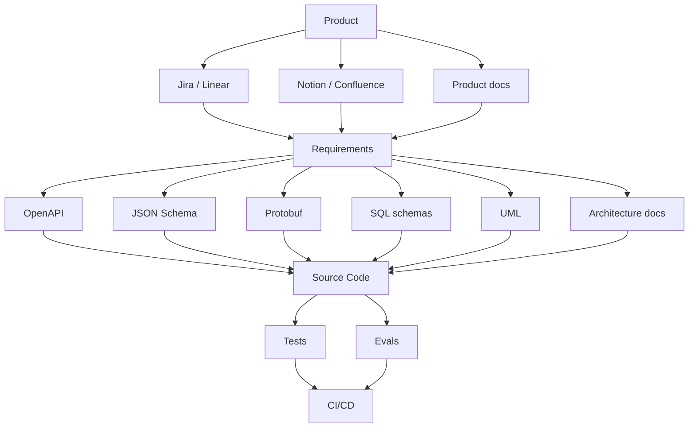
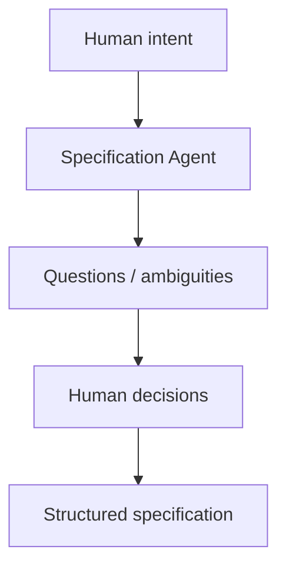
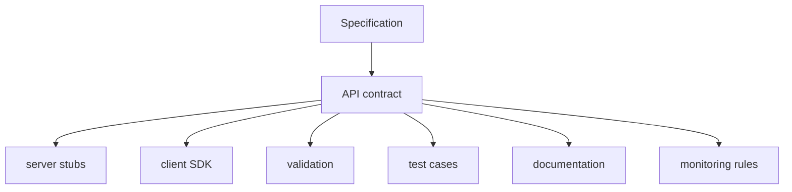
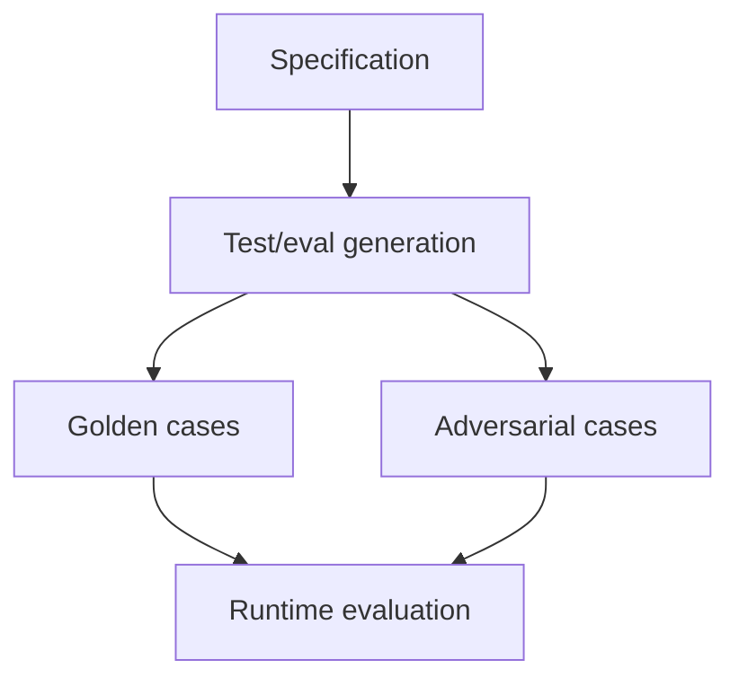
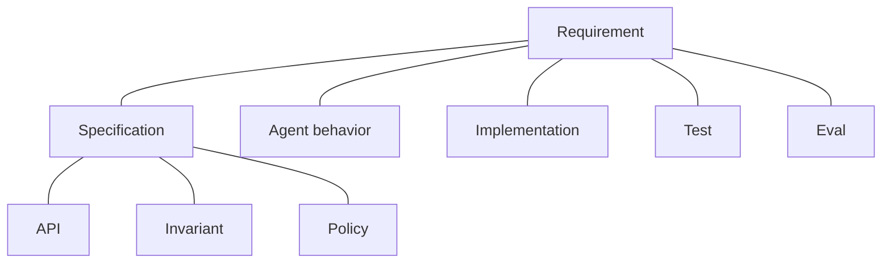
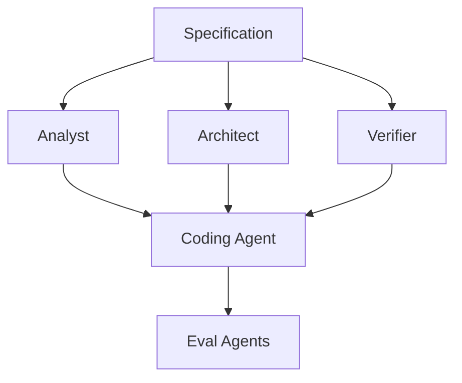
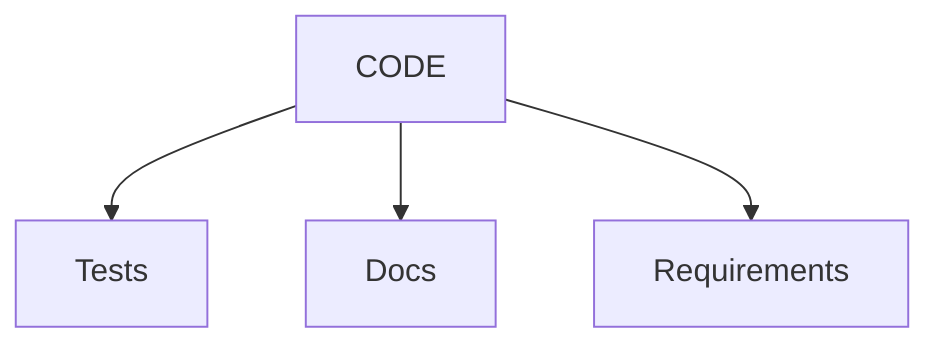
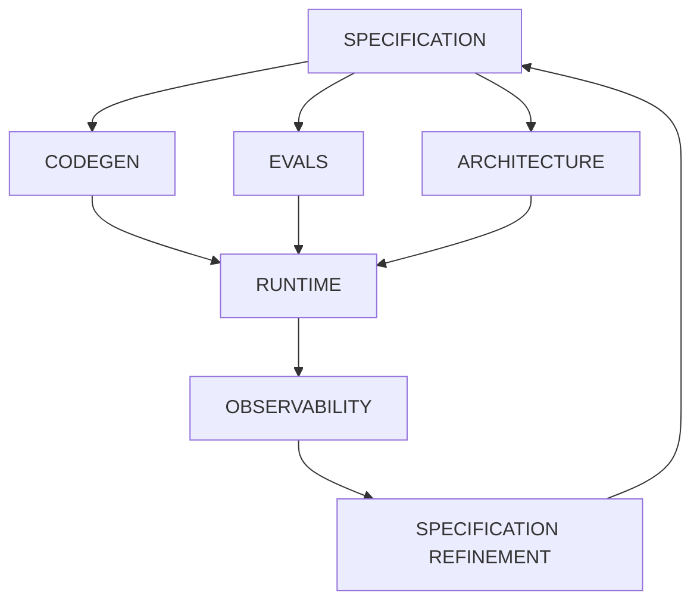

# Specification Engineering Tools

The Specification Engineer's toolchain is best understood as a new layer of the software-development stack — not merely better requirements-management software. The preceding chapter described what a Specification Engineer does; this chapter describes what they do it with.

The key shift is from:

> **documents about software**

to:

> **machine-readable artifacts that constrain, generate, and verify software.**

## The Specification Engineer's Toolbox

The tools organize into nine categories.

| Tool category             | Purpose                         | Examples today                 | Likely evolution                  |
| ------------------------- | -------------------------------- | ------------------------------- | ---------------------------------- |
| **Elicitation**           | Extract intent                   | interviews, product docs, LLMs | AI specification agents           |
| **Specification editors** | Define structured behavior       | Markdown, YAML, JSON Schema    | Spec IDEs                         |
| **Modeling**              | Model states/workflows           | UML, state machines, BPMN      | executable behavioral models      |
| **Contracts**             | Define interfaces                | OpenAPI, Protobuf, JSON Schema | contract synthesis                |
| **Constraints**           | Define what must/mustn't happen  | assertions, OCL, policies      | constraint engines                |
| **Verification**          | Prove/test properties            | unit tests, formal methods     | automated spec verification       |
| **Evaluation**            | Test probabilistic behavior      | eval frameworks, LLM judges    | specification-derived evals       |
| **Traceability**          | Connect intent→implementation    | Jira, DOORS, Git               | live traceability graphs          |
| **Change management**     | Manage evolving specs            | Git, PRs, reviews              | semantic specification versioning |

The more interesting story is not any one category but how they begin to converge — and why today's version of each tool resists that convergence.

## The Fragmented Present

Today, the Specification Engineer must stitch together many tools:



The fundamental problem is that these artifacts do not form one coherent specification graph. A requirement in Jira does not necessarily know which API contract implements it. The API does not necessarily know which requirement motivated it. The test does not necessarily know which invariant it verifies. The LLM eval does not necessarily know which behavioral requirement it measures. That is beginning to change, starting with the editing surface itself.

## The Specification IDE

The most important new tool is likely to be something analogous to today's IDE, but for **system behavior rather than source code**.

```text
+------------------------------------------------------+
| Specification IDE                                    |
+------------------------------------------------------+
|                                                      |
| Requirements                                         |
|   R1  Users can upload documents                     |
|   R2  Users can search documents                     |
|                                                      |
| Behavior                                             |
|   B1  Document ingestion workflow                    |
|   B2  Search workflow                                |
|                                                      |
| Contracts                                            |
|   C1  POST /documents                                |
|   C2  POST /search                                   |
|                                                      |
| Invariants                                           |
|   I1  User isolation                                 |
|   I2  Deleted documents never retrieved              |
|                                                      |
| Evals                                                |
|   E1  Retrieval accuracy                             |
|   E2  Groundedness                                   |
|                                                      |
| Coverage                                             |
|   Requirements: 100%                                 |
|   Invariants: 100%                                   |
|   Evals: 94%                                         |
|                                                      |
+------------------------------------------------------+
```

The editor understands the semantics of the artifacts. Changing:

```text
I1: Users cannot access another user's documents.
```

immediately surfaces:

```text
Affected:
  API-C1
  Retrieval workflow B2
  Authorization policy P3
  Tests T17, T18
  Eval E7
  Agent permissions A2
```

That is considerably more powerful than editing a Word document, and it changes who is expected to write the specification in the first place.

## Natural Language as an Interface

The Specification Engineer will not necessarily write every specification manually. Consider the statement:

> "The user should be able to share a document with another employee."

The specification agent responds:

> What constitutes an employee?
>
> Can access be revoked?
>
> Does revocation take effect immediately?
>
> Can the recipient reshare?
>
> What happens to existing cached content?
>
> Should sharing generate an audit event?

The agent performs **requirements elicitation and ambiguity detection**. The engineer then approves the resulting structured specification:



This is likely to become one of the most important AI-native engineering workflows — though natural language alone will not carry the full weight of a specification.

## A Polyglot Specification Language

Specifications increasingly combine several notations, each suited to a different aspect of the same requirement.

Natural language is good for intent:

> Users can share documents.

Structured schemas are good for structure:

```yaml
share_document:
  actor: authenticated_user
  target: organization_user
  permission: read
```

Formal constraints are good for invariants:

```text
target.organization == document.organization
```

Executable assertions are good for verification:

```text
assert unauthorized_user_cannot_read(document)
```

Evaluation specifications are good for probabilistic behavior:

```text
groundedness >= 0.95
citation_accuracy >= 0.98
```

The future specification language is therefore polyglot — natural language, schemas, contracts, constraints, executable tests, and AI evaluation criteria layered over the same underlying intent. The formal-constraints layer, in particular, opens the door to tooling that has historically stayed outside mainstream development.

## Formal Methods Move Toward the Mainstream

Historically, formal verification has been expensive and specialized. Specification Engineering creates a natural place for it.

Instead of asking:

> "Can we formally verify the entire application?"

the relevant question becomes:

> "Which properties are important enough to formally constrain?"

For example:

```text
Security invariant:
    user A can never read user B's private document

Financial invariant:
    account balance cannot become negative

Workflow invariant:
    payment cannot be marked COMPLETED without authorization

Agent invariant:
    agent cannot execute privileged tool without approval
```

Tools such as TLA+, SMT/SAT solvers, model checkers, type systems, and policy engines increasingly operate underneath the specification environment. The Specification Engineer does not necessarily need to be a formal-methods specialist: the AI can translate "a payment cannot be captured twice" into a formal property and ask the solver whether the modeled workflow permits a violation. The same generative relationship — specification in, artifact out — extends beyond formal properties to interface contracts themselves.

## Contracts as Generative Sources

Today, OpenAPI, Protobuf, and JSON Schema primarily describe interfaces. Future systems treat the contract as a generative source:



The Specification Engineer therefore spends less time writing boilerplate and more time defining semantics. The same principle applies to database schemas, event schemas, policy definitions, and agent tool definitions — and, most consequentially, to the eval suites that verify AI-specific behavior.

## Generating the Eval Suite

This is particularly important for AI systems. Suppose the specification states:

> The assistant must answer questions using only information contained in authorized documents.

The system automatically derives tests such as:

```text
1. Question answerable from authorized document
2. Question requiring unauthorized document
3. Question with conflicting documents
4. Question with no supporting evidence
5. Prompt injection inside a document
6. Question requiring multiple documents
7. Ambiguous question
```



This creates an essential feedback loop: the specification defines not only what the agent should do, but how the system determines whether the agent did it. That feedback loop only works, however, if every artifact it touches can be traced back to the specification that produced it.

## Traceability as a Graph

Instead of a linear chain — requirement, ticket, code, test — the result is a semantic graph:



The system can then answer questions such as which requirements are not covered by tests, which implementation behavior is not justified by a specification, which specifications have contradictory constraints, and which eval failures correspond to specification violations. This is **semantic traceability** rather than project-management traceability, and it changes what a "diff" means.

## Git as Specification Control

Today, `git diff` shows something like:

```diff
- timeout = 30
+ timeout = 10
```

A future specification-aware system reports instead:

```text
Behavioral change detected:

Search timeout:
    30s → 10s

Affected specifications:
    S-17 Retrieval
    S-21 Availability

Affected guarantees:
    G-04 Search availability

Affected evaluations:
    E-12 timeout recovery

Potential violation:
    S-21 requires recovery within 15s.
```

That is a fundamentally richer notion of change management: the important object is not what lines changed, but what system behavior changed. Making that distinction operational is, in practice, the job of a growing roster of specialized agents.

## Agents as Specification Engineering Tools

Several specialized agent roles are likely to emerge: a Specification Analyst that extracts requirements and identifies ambiguity; a Specification Architect that turns requirements into behavioral models and contracts; a Constraint Engineer that finds and formalizes invariants; a Test/Eval Engineer that generates verification from specifications; a Consistency Agent that looks for contradictions; a Traceability Agent that maintains requirement-to-implementation relationships; a Change Impact Agent that analyzes proposed specification changes; and a Review Agent that challenges the specification before implementation begins.

Instead of one coding agent doing everything:



This is much closer to multi-agent engineering than to a single generalist assistant. Underlying all of these roles is a single capability worth calling out on its own: detecting ambiguity before it reaches implementation.

## The Ambiguity Detector

This deserves treatment as a first-class capability. Consider a system report of the following form:

```text
SPECIFICATION ANALYSIS

Ambiguities: 7
Contradictions: 2
Untestable requirements: 4
Missing failure behavior: 11
Missing authorization rules: 3
Missing performance bounds: 6
Undefined terminology: 9
```

For example:

> "The system should respond quickly."

The tool responds:

> Define "quickly."
>
> Is this p50, p95, or p99?
>
> What workload?
>
> What payload size?
>
> What availability target?

This turns specification quality itself into something measurable. Taken together with the Specification IDE, the polyglot language, and the agent roster, it suggests where the primary engineering artifact eventually settles.

## The Primary Artifact, Eventually

Today:



Future:



Code becomes increasingly derived; specifications become increasingly authoritative. That is the profound change, and it is worth laying out the full stack this implies.

## The Future Specification Engineering Stack

```text
+-----------------------------------------------+
|              HUMAN INTENT                     |
+-----------------------------------------------+
| Specification elicitation                     |
| ambiguity detection                           |
| domain modeling                               |
+-----------------------------------------------+
|              SPECIFICATION                    |
|                                               |
| behavior | contracts | constraints | policies |
| state    | invariants | edge cases | failures |
+-----------------------------------------------+
|              DERIVATION                       |
|                                               |
| architecture | APIs | schemas | tests | evals |
+-----------------------------------------------+
|              AI ENGINEERING                   |
|                                               |
| coding agents | test agents | review agents   |
+-----------------------------------------------+
|              VERIFICATION                     |
|                                               |
| tests | formal checks | evals | security      |
+-----------------------------------------------+
|              RUNTIME                          |
|                                               |
| telemetry | traces | failures | user feedback |
+-----------------------------------------------+
|              LEARNING                         |
|                                               |
| specification refinement                      |
+-----------------------------------------------+
```

### Three Evolutionary Stages

This stack does not appear fully formed; it arrives in three stages.

**Today: Documentation.** Specifications are mostly documents that humans interpret.

**Near term: Structured specification.** Specifications become machine-readable and generate contracts, tests, evals, and implementation scaffolding.

**Long term: Executable specification.** Specifications become active system artifacts that constrain agents, generate implementations, drive verification, monitor production behavior, and evolve from observed failures.

That trajectory leads to a different definition of the engineer than the one the industry has used for decades: the traditional software engineer primarily transforms specifications into code, while the AI-native Specification Engineer transforms intent into specifications that machines can implement and verify. Across the three chapters in this sequence, the same argument recurs at increasing resolution: as the marginal cost of generating code approaches zero, the bottleneck moves from implementation to precise specification, verification, and control.
